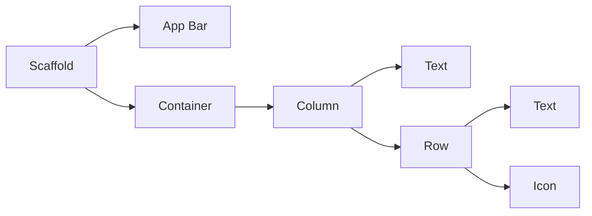

# Flutter Framework App Development

Here are my simplified notes for Flutter App Development, using DART programming language.      

Used for building iOS & Android Phone Apps, Web Apps, etc.

# Table of Contents

1. **Introduction**
   1. Why Flutter
   2. The Anatomy of a Flutter App
   3. Setup & Installation
2. **Printing**
3. **Variables**
4. **Arithmetic Operations**
5. Methods
6. ....

<br>

****

<br/>


# Section 1: Introduction to Flutter Framework

## Why Flutter?

- Used for building IOS Apps, Android Apps, Web Apps.

- **One Codebase** for both IOS and Android App development (Only need to maintain this one codebase for any changes/updates to app)     

  > Only need to know one language - Dart      
  >
  > Dart is used to build phone apps (Flutter), Web Apps (Hummingbird)

- Good support over **apps of different screen sizes** (phones, tablets, tv screens, etc....)     

  > This is important as there will be too many screen sizes to support manually:      
  >
  > Apple: ipadpro, ipadair, phones.....      
  >
  > Android: Open-sourced - meaning anyone can create their own smart devices with whatever screen size

- Flexible Layout System

  > Flutter is a UI Toolkit that makes it easy for developers to design beautiful interfaces for all sorts screen sizes and devices.      
  >
  > Comes with many pre-built widgets to use       
  >
  > 

- It is all about the **Widget**-based development for flutter

- **Hot Reload system**: Seeing your UI changes almost immediately as soon as you click "save" - way faster development

- For deeper development, you get to see the **original source code** of widgets etc. as Flutter is Open-Source      

  Benefits: You are aware of the exact behavior of components and you can create your own components based off on the original source code.

  > Such things are a mystery for many iOS components.

## The Anatomy of a Flutter App

Everything inside a Flutter App are **widgets** - you are building widgets upon widgets

- Imagine the widget tree



- Scaffold is the base blank screen for the app
- AppBar is a pre-built widget that looks and acts like an app bar
- Container is a box that holds widgets inside it
- Column contains a list of widgets that scroll vertically - arranged on top of one another
- Row contains a list of widgets that scroll horizontally - arranged side by side of  one another

## Setup & Installation

##### Code editor

 Android Studio, Visual Studio Code.      

Preferred to use Android Studio as its easier to work with emulator and android packages. Some tools are specially developed for Android Studio.

##### Testing Android Apps from Flutter

Easy to use physical Android phones, or Android Emulators

##### Testing iOS Apps from Flutter

You will need a mac to test! (security reasons from Apply - Code Signing). Even for the iOS Simulator.

<br/>

Can try using **Codemagic** to "Build, test and deliver your Flutter apps in record time". - Continuous integration and delivery for Flutter Apps

<br/>

#### Installing Flutter

1. Go to Flutter website and install Flutter sdk: https://flutter.dev/docs/get-started/install/windows.

   > Note: Install in a file path that does not require elevated privileges. Recommended C:\src\flutter

2. Add File Path for Flutter

   For windows: Edit environment variables for your account --add location of bin folder

   ```
   Once done, you should be able to check this in your Command Prompt:
   
   flutter --version
   ```

3. Use flutter doctor to check that set up is good for flutter to work well

   ``` 
   Type in Command Prompt:
   flutter doctor
   ```

   

<br/>


# Section 2: sdsdas

#### Title 1

```
ssdsadasd
```

<br/>


****

Credits: https://github.com/londonappbrewery/Flutter-Course-Resources