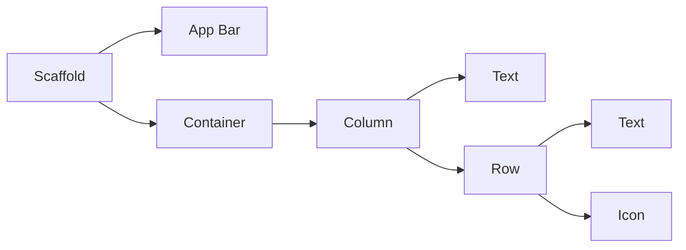
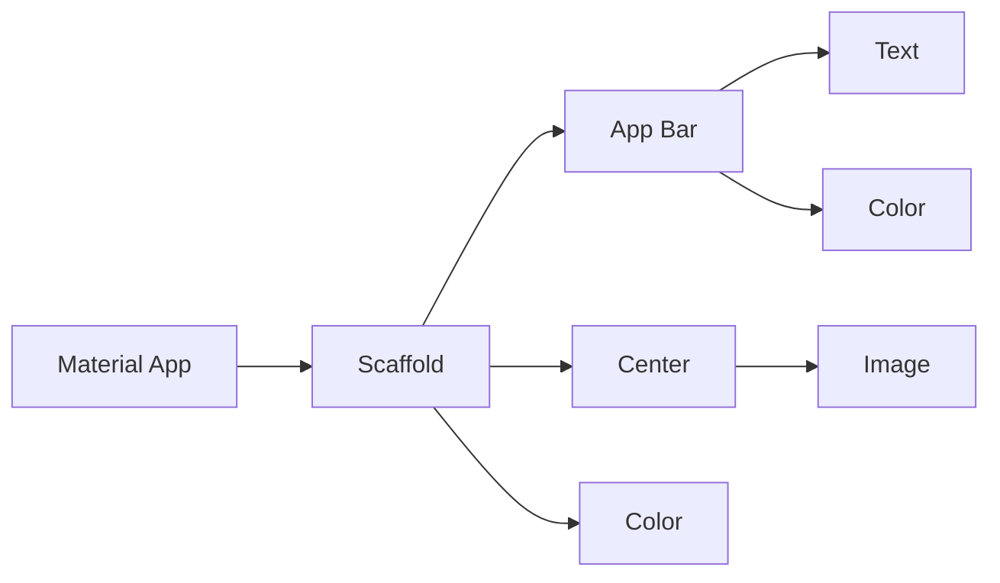

# Flutter Framework App Development

Here are my simplified notes for Flutter App Development, using DART programming language.      

Used for building iOS & Android Phone Apps, Web Apps, etc.

# Table of Contents

1. **Introduction**
   1. Why Flutter
   2. The Anatomy of a Flutter App
   3. Setup & Installation
2. **Section 2: Creating an App - First Steps**
   1. MaterialApp Class
   2. Formatting Code
   3. Hot Reload Feature
   4. Scaffolding a Flutter App
   5. Planning the Structure of a Flutter App
   6. Adding Custom App Icons
   7. Testing your Flutter App
   8. External Resources to Use in App
   9. Dart SDK
3. **Section 3: Using Flutter Layout UI**
   1. Container Widget
   2. Column & Row Widgets
   3. Adding Custom Fonts
   4. Icons Widget
   5. Card Widget
   6. Divider Widget
   7. Expanded Widget
   8. URL Launcher
   9. Layout Tips
4. **Section 4: Handling States & Functions**
5. **Dart Language**
6. **Other Cool Open-Source Flutter Apps**
7. ....

<br>

****

<br/>


# Section 1: Introduction to Flutter Framework

## Why Flutter?

- Used for building IOS Apps, Android Apps, Web Apps.

- **One Codebase** for both IOS and Android App development (Only need to maintain this one codebase for any changes/updates to app)     

  > Only need to know one language - Dart      
  >
  > Dart is used to build phone apps (Flutter), Web Apps (Hummingbird)

- Good support over **apps of different screen sizes** (phones, tablets, tv screens, etc....)     

  > This is important as there will be too many screen sizes to support manually:      
  >
  > Apple: ipadpro, ipadair, phones.....      
  >
  > Android: Open-sourced - meaning anyone can create their own smart devices with whatever screen size

- Flexible Layout System

  > Flutter is a UI Toolkit that makes it easy for developers to design beautiful interfaces for all sorts screen sizes and devices.      
  >
  > Comes with many pre-built widgets to use       
  >
  > 

- It is all about the **Widget**-based development for flutter

- **Hot Reload system**: Seeing your UI changes almost immediately as soon as you click "save" - way faster development

- For deeper development, you get to see the **original source code** of widgets etc. as Flutter is Open-Source      

  Benefits: You are aware of the exact behavior of components and you can create your own components based off on the original source code.

  > Such things are a mystery for many iOS components.

## The Anatomy of a Flutter App

Everything inside a Flutter App are **widgets** - you are building widgets upon widgets

- Imagine the widget tree



- Scaffold is the base blank screen for the app
- AppBar is a pre-built widget that looks and acts like an app bar
- Container is a box that holds widgets inside it
- Column contains a list of widgets that scroll vertically - arranged on top of one another
- Row contains a list of widgets that scroll horizontally - arranged side by side of  one another

## Setup & Installation

##### Code editor

 Android Studio, Visual Studio Code.      

Preferred to use Android Studio as its easier to work with emulator and android packages. Some tools are specially developed for Android Studio.

##### Testing Android Apps from Flutter

Easy to use physical Android phones, or Android Emulators

##### Testing iOS Apps from Flutter

You will need a mac to test! (security reasons from Apply - Code Signing). Even for the iOS Simulator.

<br/>

Can try using **Codemagic** to "Build, test and deliver your Flutter apps in record time". - Continuous integration and delivery for Flutter Apps

<br/>

#### Installing Flutter

1. Go to Flutter website and install Flutter sdk: https://flutter.dev/docs/get-started/install/windows.

   > Note: Install in a file path that does not require elevated privileges. Recommended C:\src\flutter

2. Add File Path for Flutter

   For windows: Edit environment variables for your account --add location of bin folder

   ```
   Once done, you should be able to check this in your Command Prompt:
   
   flutter --version
   ```

3. Use flutter doctor to check that set up is good for flutter to work well

   ``` 
   Type in Command Prompt:
   flutter doctor
   ```

   > This is quite a useful tool as it checks all the dependencies, including whether you have downloaded Flutter plugin on android studio

4. Install Flutter Plugin on Android Studio

   Go to Settings > Plugins       

   Type in 'Flutter' and install it. Afterwards you will have to restart the IDE for plugin changes to take place.     

   Once this is done, you should be able to see "Start a new Flutter project" in you welcome screen or when you create a new project     

5. Download a Phone Emulator (if you do not have one yet)

   Open AVD manager > Choose a phone (recommended Nexus series) > Choose an OS     

   > For Emulated Performance: Graphics, recommended to use Hardware for faster performance.

**You are set up to use flutter and dart to develop flutter apps for Android!**

<br/>


# Section 2: Creating an App - First Steps

## MaterialApp Class

This is an important app to use as your app's scaffold.     

Taps straight into the **Material Design** that is being used by many app creators - standard design templates that can be used straight.          

https://material.io/design/

Built by Google     

#### Basic barebones app with MaterialApp:

```
import 'package:flutter/material.dart';

void main() => runApp(MaterialApp(home: Text('Hello world')));
```

#### Center Widget

To center other widgets, you can place them into a **Center Widget**

> Note how Flutter is made up of Widgets ---including this centering behaviour

```
import 'package:flutter/material.dart';

void main() => runApp(MaterialApp(home: Center(child: Text('Hello world'))));
```

## Formatting Code

#### Using in-built re-formatter: **"Reformat Code with dartfmt"**     

BUT to use this, we need to add a comma at each parenthesis of hierarchy to signal to dartfmt formatter of the hierarchy of widgets. ie.     

###### FROM THIS:   

```
import 'package:flutter/material.dart';

void main() => runApp(MaterialApp(home: Center(child: Text('Hello world'))));
```

###### TO THIS:

```
import 'package:flutter/material.dart';

void main() => runApp(MaterialApp(home: Center(child: Text('Hello world'),),),);

```

###### Click "Reformat Code with dartfmt"

```
import 'package:flutter/material.dart';

void main() => runApp(
      MaterialApp(
        home: Center(
          child: Text('Hello world'),
        ),
      ),
    );

```

> This will automatically arrange and format code in a very readable format.

###### Change the fat arrow '=>' to curly braces '{}' for better readability

```
import 'package:flutter/material.dart';

void main() { runApp(
      MaterialApp(
        home: Center(
          child: Text('Hello world'),
        ),
      ),
    );
}
```

## Hot Reload Feature

One of the key features of Flutter: 

### **Hot Reload**    

Allows almost instant changes to UI to be seen (but there are caveats for this useful feature)     

> Ie. Changes can only be seen for Hot Reload for a few instances - not for all kinds of changes

#### Changes must be inside a Flutter Stateless or Stateful widget

We can create our own **StatelessWidget** by using the boilerplate code for building a stateless widget       

Shortcut: type *stless* and select shortcut

```
class MyApp extends StatelessWidget {
  @override
  Widget build(BuildContext context) {
    return Container();
  }
}
```

We just have to throw everything that we coded for the app into this StatelessWidget.

```
import 'package:flutter/material.dart';

void main() { runApp(
  MyApp()
    );
}
class MyApp extends StatelessWidget {
  @override
  Widget build(BuildContext context) {
    return MaterialApp(
      home: Center(
        child: Text('Hello world'),
      ),
    );
  }
}

```

Now any changes that you do under this stateless widget of MyApp will be reflected using **Hot Reload **     

Almost 'live' changes - updates in fractions of seconds

> Saves us a lot of time by recompiling and building app - especially for huge apps.     
>
> Especially if you make a lot of minute UI changes.

Note: You will not lose the in-app data.

### Hot Restart

If you want to test the app from the start    

It acts like Hot Reload, but it refreshes whatever in-app data/progress you have done.

## Scaffolding a Flutter App

Place whatever you need onto the scaffold - like a background to the app.    

https://api.flutter.dev/flutter/material/Scaffold-class.html       

```
import 'package:flutter/material.dart';

void main() {
  runApp(MyApp());
}

class MyApp extends StatelessWidget {
  @override
  Widget build(BuildContext context) {
    return MaterialApp(
      home: Scaffold(),
    );
  }
}
```

### Components you can add: 

- appBar - a component (properties: title, backgroundColor,....)

- backgroundColor

- body

- drawer

- floatingActionButton

- bottomNavigationBar

- ... etc

  > visit https://api.flutter.dev/flutter/material/Scaffold-class.html#instance-properties  to find more

eg for appBar:

```
import 'package:flutter/material.dart';

void main() {
  runApp(MyApp());
}

class MyApp extends StatelessWidget {
  @override
  Widget build(BuildContext context) {
    return MaterialApp(
      home: Scaffold(
        appBar: AppBar(
          title: Text('I AM RICH'),
          backgroundColor: Colors.blueGrey[900],
        ),
      ),
    );
  }
}
```

> Useful to use the Material Colors from MaterialDesign.     
>
> https://material.io/design/color/the-color-system.html#tools-for-picking-colors      
>
> We can do this as we are using a MaterialApp.

### Body

This is where the main content of the scaffold class is placed at.

##### Image widget

Note that there are many different types of libraries for Image. Need to choose the right one.     

https://api.flutter.dev/flutter/widgets/Image-class.html

Properties:      

- image
- repeat
- height
- width
- color
- alignment
- ....etc

```
import 'dart:ui';

import 'package:flutter/material.dart';

void main() {
  runApp(MyApp());
}

class MyApp extends StatelessWidget {
  @override
  Widget build(BuildContext context) {
    return MaterialApp(
      home: Scaffold(
        backgroundColor: Colors.blueGrey,
        appBar: AppBar(
          title: Text('I AM RICH'),
          backgroundColor: Colors.blueGrey[900],
        ),
        body: Image(
          image: NetworkImage('https://images.unsplash.com/photo-1575616652983-23b9a2987012?ixlib=rb-1.2.1&ixid=eyJhcHBfaWQiOjEyMDd9&auto=format&fit=crop&w=634&q=80'),
        ),
      ),
    );
  }
}

```

What if you want to center an image?

> Tip: Click on Image widget and use Alt+Enter: "Wrap with Center"     
>
> Flutter will automatically wrap the whole image widget in a Center widget
>
> ```
> import 'dart:ui';
> 
> import 'package:flutter/material.dart';
> 
> void main() {
>   runApp(MyApp());
> }
> 
> class MyApp extends StatelessWidget {
>   @override
>   Widget build(BuildContext context) {
>     return MaterialApp(
>       home: Scaffold(
>         backgroundColor: Colors.blueGrey,
>         appBar: AppBar(
>           title: Text('I AM RICH'),
>           backgroundColor: Colors.blueGrey[900],
>         ),
>         body: Center(
>           child: Image(
>             image: NetworkImage('https://images.unsplash.com/photo-1575616652983-23b9a2987012?ixlib=rb-1.2.1&ixid=eyJhcHBfaWQiOjEyMDd9&auto=format&fit=crop&w=634&q=80'),
>           ),
>         ),
>       ),
>     );
>   }
> }
> 
> ```

###### To use Image from our local app folder:

We have to go to pubspec.yaml and uncheck the Assets section

```
 # To add assets to your application, add an assets section, like this:
 # assets:
  #  - images/a_dot_burr.jpeg
  #  - images/a_dot_ham.jpeg
```

Insert the correct directory and file we want to use:

```
# To add assets to your application, add an assets section, like this:
  assets:
    - images/diamondImage.jpeg
```

This tells our flutter app about this particular asset - after which we can use this asset anywhere in our flutter app, eg main.dart

<br/>

**CTRL + Q** on widget to see **QUICK DOCS** on more info about the widget

<br/>

## Planning the Structure of a Flutter App

There are many tools that can be used to plan the structure of any app, not just flutter app. It is essentially like a diagram or a flowchart to see the hierarchy of widgets for flutter app.     

Can use www.draw.io  to plan.    

Note for the app above:     



> THE POWER OF FLUTTER APP - LEVERAGING THE POWER OF PRE-BUILT WIDGETS FROM FLUTTER TO BUILD IOS & ANDROID APPS:     
>
> All of these in under 30 lines of written code

## Adding Custom App Icons

Go to www.appicon.co     

Good platform to generate app icons for different devices: iPhone, iPad, Android, etc...       

This generates all the required files and formats for android and ios

###### Android

Go to android>app>src>main>res     

Delete all existing mipmap folders and copy the generated mipmap folders in.    

Make sure the names of the icons in the mipmap folders must be "ic_launcher"    

> Note: Recent designs of Android Icons are Circular style         
>
> How to resize/reformat style:       
>
> Go to res folder and create new Image Asset      
>
> Go to path and pick the image of the icon you want       
>
> Manually resize every app icon you want so that it looks good.     
>
> This will manually replace all the existing app icons you have in your mipmap folders.

###### iOS

Go to ios>Runner>Assets.xcassets     

Delete Assets.xcassets folder and copy the generated Assets.xcassets folder in.     

<br/>

> All your App Icons for Android and iOS are updated with the new one!!

## Testing your Flutter App

### Android

###### Enable Developer Mode

Go to Settings>About Phone>Software Information      

Keep tapping on Build number until it says you have enabled developer mode      

###### Enable USB Debugging

Go to Settings> Developer Options       

Enable USB debugging     

###### Connect Your Phone with USB

Check "Always allow from this computer" to save much hassle

###### Run App from Android Studio

On Android Studio, select your phone instead of the emulator phone     

Load app into your phone!


## External Resources to Use in App

- www.icons8.com

  Beautiful Illustrations and Icons by artists

- www.vecteezy.com

  larger list of icons

- www.canva.com

  > Remember to credit the artworks from artists


## Dart SDK

### Selecting Dart SDK Path

Sometimes, the Dart SDK path may not be specified if you clone from other projects.     

You have to manually specify from the folder you have saved the flutter folder in.

```
C:\src\flutter\flutter\bin\cache\dart-sdk
```

For new projects, packages may not have been installed/set up properly.

*Get dependencies* to automatically install the required dependencies to run the project

<br/> 

# Section 3: Using Flutter Layout UI

Go to [Flutter Layout Widgets](https://flutter.dev/docs/development/ui/widgets/layout) to read up on documentation on any new layout widget you come across before using them.    

Good summary [Flutter Layout Cheatsheet](https://medium.com/flutter-community/flutter-layout-cheat-sheet-5363348d037e)

## Container Widget

Essentially a layout box - similar to the term 'div' in web dev.

> Note:       
>
> Containers with no children try to be as big as possible unless the incoming constraints are unbounded        
>
> Containers with children size themselves to their children - something **different **      
>
> The width, height and constraints arguments to the constructor override this.

### SafeArea Widget

If we do not wrap our main body content inside a SafeArea widget, contents may spill over to the top bar where our android icons are (time, battery status etc.) as well as the bottom especially for iPhones.     

We can  Alt + Enter and **Wrap with Widget** to the container.     

Afterwards, change the name of the widget to use the '**SafeArea**' widget

### Setting Size 

- height

- width

- margin       

  ```
  margin: EdgeInsets.all(10.0),
  ```

  ```
  margin: EdgeInsets.symmetric(vertical: 50.0, horizontal: 30.0),
  ```
  ```
  margin: EdgeInsets.fromLTRB(10.0, 20.0, 30.0, 5.0),
  ```
   ```
  margin: EdgeInsets.only(left: 10.0),
   ```
  
- padding       

  Same as margin above

  ```
  padding: padding: EdgeInsets.all(20.0),
  ```

Check sizing with Flutter inspector > Margin Inspector       

Summary:

```
import 'package:flutter/material.dart';

void main() {
  runApp(MyApp());
}

class MyApp extends StatelessWidget {
  @override
  Widget build(BuildContext context) {
    return MaterialApp(
      home: Scaffold(
        backgroundColor: Colors.blue,
        body: SafeArea(
          child: Container(
            height: 100.0,
            width: 100.0,
            margin: EdgeInsets.only(left: 10.0),
            padding: EdgeInsets.all(20.0),
            color: Colors.white,
            child: Text('Hello'),
          ),
        ),
      ),
    );
  }
}

```


<br/>

Note layout widgets like Container are **Single-child**, meaning they can only contain 1 specified child. If there is a need for more, we need to use *Column or Row widgets*(see below)

<br/>

## Column & Row Widgets

Column and Row widgets are **Multi-child** layout widgets

### Column Widget

Add the children widgets under children

```
Column(
          children: <Widget>[    
          
          ] 
)
```

##### MainAxisSize

Change it to vary the size of the column

```
Column(
	mainAxisSize: MainAxisSize.min,
	children:....
)
```

If not default is the maximum size possible from top to bottom of phone.

##### VerticalDirection

Default: 

```
verticalDirection: VerticalDirection.down
```
Opposite direction:
```
verticalDirection: VerticalDirection.down
```

##### MainAxisAlignment

Default:

```
mainAxisAlignment:MainAxisAlignment.start
```
Aligned to the bottom:
```
mainAxisAlignment:MainAxisAlignment.end
```
Aligned with center:
```
mainAxisAlignment:MainAxisAlignment.end
```
Spaced evenly:
```
mainAxisAlignment:MainAxisAlignment.spaceEvenly
```
Space between (one top, one bottom, the rest spaced out):
```
mainAxisAlignment:MainAxisAlignment.spaceBetween
```
Cross Axis Alignment - End - children aligned towards the right horizontally (with respect to the largest child)
```
mainAxisAlignment:CrossAxisAlignment.end
```
Cross Axis Alignment - Stretch - Stretch all children across the screen - no need to manually adjust width to double.infinity for all children
```
mainAxisAlignment:CrossAxisAlignment.stretch
```

##### Sized Box

An empty div box that provides some spacing

```
SizedBox(
height: 20.0,
),
```

### Row Widget

Works the same as a Column Widget, but in the other direction - children arranged from left to right

## Adding Custom Fonts

### Use Google Fonts

- Go to https://fonts.google.com/ - free for commercial use
- Download the font that you want

- Create new folder called 'fonts'

- Update on pubspec:

  ```
   fonts:
    - family: Pacifico
      fonts:
         - asset: fonts/Pacifico-Regular.ttf
    - family: Source Sans Pro
      fonts:
         - asset: fonts/SourceSansPro-Regular.ttf
  ```

Use font under Text:

```
Text('Software Engineer',
              style: TextStyle(
                fontFamily: 'Source Sans Pro',
                color: Colors.blueGrey.shade200,
                fontSize: 20.0,
                letterSpacing: 2.5,
                fontWeight: FontWeight.w400,

              ),)
```

## Icons Widget

Icons are one of the most frequently used widget - buttons, boxes, etc.        

 We can find most of the Icons that we want at [Material Design Icons](https://material.io/resources/icons/?style=baseline)     

Useful Tool for Material Design: [Material Design Palette](https://www.materialpalette.com/)      

Find the Icon that you want on Material Icons, note the name and add into code

```
Container(
                child: Row(
                  children: <Widget>[
                    Icon(Icons.add_shopping_cart),
                  ],
                ),
              ),
```

Icons are better than Vectors as their properties are more flexible. Eg. you can change color, size, etc without decrease in quality

## Card Widget

This is a useful widget for many purposes - it is a better Container Widget, that makes it look way better      

For all the properties of a Card Widget: https://api.flutter.dev/flutter/material/Card-class.html

#### Properties

- shape
- elevation
- borderOnForeground
- color
- ....

> Note Card Widget does not have a padding property     
>
> Solution: Use **Padding Widget** as a child to the Card Widget

#### Padding Widget (used as child of Card Widget)

```
Card(
                color: Colors.white,
                margin: EdgeInsets.symmetric(vertical: 10.0, horizontal: 25.0),
                child: Padding(
                  padding: EdgeInsets.all(25.0),
                  child: Row(
                    children: <Widget>[
                      Icon(
                        Icons.phone,
                        color: Colors.grey[700],
                      ),
                    ],
                  ),
                ),
              ),
```

#### ListTile Widget (used as child of Card Widget)

https://api.flutter.dev/flutter/material/ListTile-class.html       

When you want to add these in a Card:      

- Icons
- Text

> "A single fixed-height row that typically contains some text as well as a a leading or training icon"

Properties of ListTile:

- leading

- title

- subtitle

- onTap

- trailing

- ....etc

  Using it in a card:

```
Card(
                color: Colors.white,
                margin: EdgeInsets.symmetric(vertical: 10.0, horizontal: 25.0),
                child: ListTile(
                  leading: Icon(
                    Icons.email,
                    color: Colors.grey[700],
                  ),
                  title:Text(
                    'daryll_wong@hotmail.com',
                    style: TextStyle(
                      color: Colors.blueGrey[900],
                      fontFamily: 'Source Sans Pro',
                      fontSize: 20.0,
                    ),
                  ),
                )
              ),
```

## Divider Widget

[Divider Widget](https://api.flutter.dev/flutter/material/Divider-class.html) is simply a useful divider line.     

Mainly used for Aesthetics

#### Properties

- thickness
- color
- height
- width

```
SizedBox(
                height: 20.0,
                width: 150.0,
                child: Divider(
                  color: Colors.white,
                  thickness: 1.0,
                ),
              ),
```

## Expanded Widget

### Problem:

**Overflowing** of images, widges etc

### What does it do:

The [Expanded Widget](https://api.flutter.dev/flutter/widgets/Expanded-class.html) "expands a child of a [Row](https://api.flutter.dev/flutter/widgets/Row-class.html), [Column](https://api.flutter.dev/flutter/widgets/Column-class.html), or [Flex](https://api.flutter.dev/flutter/widgets/Flex-class.html) so that the child fills the available space."      

Using an [Expanded](https://api.flutter.dev/flutter/widgets/Expanded-class.html) widget makes a child of a [Row](https://api.flutter.dev/flutter/widgets/Row-class.html), [Column](https://api.flutter.dev/flutter/widgets/Column-class.html), or [Flex](https://api.flutter.dev/flutter/widgets/Flex-class.html) expand to fill the available space along the main axis (e.g., horizontally for a [Row](https://api.flutter.dev/flutter/widgets/Row-class.html) or vertically for a [Column](https://api.flutter.dev/flutter/widgets/Column-class.html)). If multiple children are expanded, the available space is divided among them according to the [flex](https://api.flutter.dev/flutter/widgets/Flexible/flex.html) factor.      

An [Expanded](https://api.flutter.dev/flutter/widgets/Expanded-class.html) widget must be a descendant of a [Row](https://api.flutter.dev/flutter/widgets/Row-class.html), [Column](https://api.flutter.dev/flutter/widgets/Column-class.html), or [Flex](https://api.flutter.dev/flutter/widgets/Flex-class.html), and the path from the [Expanded](https://api.flutter.dev/flutter/widgets/Expanded-class.html) widget to its enclosing [Row](https://api.flutter.dev/flutter/widgets/Row-class.html), [Column](https://api.flutter.dev/flutter/widgets/Column-class.html), or [Flex](https://api.flutter.dev/flutter/widgets/Flex-class.html) must contain only [StatelessWidget](https://api.flutter.dev/flutter/widgets/StatelessWidget-class.html)s or [StatefulWidget](https://api.flutter.dev/flutter/widgets/StatefulWidget-class.html)s (not other kinds of widgets, like [RenderObjectWidget](https://api.flutter.dev/flutter/widgets/RenderObjectWidget-class.html)s).      

```
Expanded(
          child: Image(
            image: AssetImage('images/dice1.png'),
          ),
```

### Properties:

- child

- flex (how many 'size' it takes up ie. ratio)

  ```
  Row(
        children: <Widget>[
          Expanded(
            flex: 2,
            child: Image(
              image: AssetImage('images/dice1.png'),
            ),
          ),
          Expanded(
            child: Image(
              image: AssetImage('images/dice1.png'),
            ),
          ),
        ],
      );
  ```

  

- fit

- key

- ...


## URL Launcher

[URL Launcher](https://pub.dev/packages/url_launcher) is a dependency that helps to open URL

https://alligator.io/flutter/url-launcher/

### Open URL

#### Add Dependency in pubspec.yaml

```
dependencies:
  flutter:
    sdk: flutter
  url_launcher: ^5.2.5
```

#### Add function

**Use onTap/onPressed**      

(depending on which widget is used)

```
import 'package:flutter/material.dart';
import 'package:url_launcher/url_launcher.dart';

void main() {
  runApp(Scaffold(
    body: Center(
      child: RaisedButton(
        onPressed: _launchURL,
        child: Text('Show Flutter homepage'),
      ),
    ),
  ));
}

_launchURL() async {
  const url = 'https://flutter.dev';
  if (await canLaunch(url)) {
    await launch(url);
  } else {
    throw 'Could not launch $url';
  }
}
```

Or directly add function into widget: eg.       

##### Force to open with specific browser

```
ListTile(
  title: Text("Launch Web Page"),
  onTap: () async {
    const url = 'https://google.com';

    if (await canLaunch(url)) {
      await launch(url, forceSafariVC: false);
    } else {
      throw 'Could not launch $url';
    }
  },
),
```

##### Open with in-app browser (WebView)

```
const url = 'https://google.com';

if (await canLaunch(url)) {
  await launch(url, forceWebView: true);
} else {
  throw 'Could not launch $url';
}
```

### Open Google Maps

#### Save Coordinates

```
class HomePage extends StatelessWidget {
  final String lat = "37.3230";
  final String lng = "-122.0312";

  // ...
}
```

#### Add function

```
ListTile(
  title: Text("Launch Maps"),
  onTap: () async {
    final String googleMapsUrl = "comgooglemaps://?center=$lat,$lng";
    final String appleMapsUrl = "https://maps.apple.com/?q=$lat,$lng";

    if (await canLaunch(googleMapsUrl)) {
      await launch(googleMapsUrl);
    }
    if (await canLaunch(appleMapsUrl)) {
      await launch(appleMapsUrl, forceSafariVC: false);
    } else {
      throw "Couldn't launch URL";
    }
  },
),
```

### Open Telephone

#### Save Number

```
class HomePage extends StatelessWidget {
  final String lat = "37.3230";
  final String lng = "-122.0312";

  final String telephoneNumber = "01817658822";

  // ...
}
```

#### Add Function

```
ListTile(
  title: Text("Telephone"),
  onTap: () async {
    String telephoneUrl = "tel:$telephoneNumber";

    if (await canLaunch(telephoneUrl)) {
      await launch(telephoneUrl);
    } else {
      throw "Can't phone that number.";
    }
  },
),
```

## Layout Tips

1. ### Using Flutter Outline

   - You can open Flutter Outline to wrap a widget with other widgets easily
   - Remove wrapping widget, leaving contents
   - Move position of widget up and down
   - Add Padding

2. ### Using Alt + Enter

   - Similarly, you can also wrap a widget with other widgets easily in code
   - Remove wrapping widget, leaving contents
   - Move position of widget up and down
   - Add Padding

<br/>


# Section 4: Handling States & Functions

## Buttons Widgets

### Types of Button Widgets available:

[Types of Button widgets](https://flutter.dev/docs/development/ui/widgets/material) 

- ButtonBar *
- DropdownButton
- FlatButton
- IconButton *
- FloatingActionButton
- PopupMenuButton
- RaisedButton *

### FlatButton Widget (eg)

#### Function

It is a **Zero-elevation Button** (with **text label**) that reacts to touches by filling with color

> Note this widget has default left and right padding    
>
> Check for yourself in Flutter Inspector.

```
FlatButton(
              child: Image.asset('images/dice1.png'),
            ),
```

#### onPressed

Reading documentation, note that it expects **void VoidCallback()** function     

> Signature of callbacks that have **no arguments** and **return no data**

> kind of like an Anonymous function

```
Expanded(
            child: FlatButton(
              onPressed: (){
                print("Left button pressed.");
              },
              child: Image.asset('images/dice1.png'),
            ),
          ),
```


## Functions

```
ssdsadasd
```


## Variables

Note to save variables inside **build** if not **Hot Reload** will not cause any updates - Hot Reload only updates what is changed inside of build

```
class DicePage extends StatelessWidget {
  
  @override
  Widget build(BuildContext context) {
    var leftDiceNum = 1;
    var rightDiceNum = 1;

	return ....
	.....
```


## Stateful Widget

### Stateful Widget vs Stateless Widget - whats the difference

**Stateless**: State of widget is Immutable, no change. Not meant to have any changes, and stay consistent.     

**Stateful**: State of widget can change. Changes can be seen depending on state.

### Stateful Widget

Shortcut: type "stful"     

Same as Stateless widget, copy all the cut all the code into the Stateless widget.     

Only difference is  the **setState()** method

#### setState() method

```
FlatButton(
              onPressed: () {
                setState(() {
                  leftDiceNum = 5;
                });
              },
              child: Image.asset('images/dice$leftDiceNum.png'),
            ),
```

> If setState() is not called for any changes, the app will not know that it needs to update the UI of the app accordingly.     
>
> Therefore whereever the app states will change, must use setState()

#### What happens? 

Inside setState(), the app sees what variable is changed. Afterwards, the app looks at the code and see where else is this variable used and will affect UI changes.

<br/>


# Dart Language

[Dart Online IDE](https://dartpad.dartlang.org/)       

Dart is a **Statistically-typed language**

## Print to Console

```
print('Button pressed');
```

## Functions

### Anonymous Functions

Code is added directly at where function is implemented

```
(){
	print('Hello world')
}
```

```
Expanded(
            child: FlatButton(
              onPressed: (){
                print("Left button pressed.");
              },
              child: Image.asset('images/dice1.png'),
            ),
          ),
```


### Void Callback Functions 

(Anonymous Functions too)

```
void printSomething(){
	print('Hello world')
}
```

## Data Types & Variables

```
var leftDiceNumber = 1;
```

> Note **var** type automatically assigns the first assigned data type to the variable. Any attempts to reassign to another data type would produce error!

### String

Use single-quote ' '

### Dynamic Data Type

Sometimes Dart can behave as an dynamically -typed language (with dynamic data type)        

If variable is assigned with **var** but **without a value**, then it has a **dynamic** data type. No fixed data type is assigned.    

You can also assign directly with **dynamic**

```
var a;
a = 'hello';
a = 123
//Wont produce an error.
```

OR

```
dynamic a;
a = 'hello';
a = 123
```

> Avoid using **var** or **dynamic** for less errors...


## String Interpolation

Use **$variableName** with the dollar sign to signify variable name.

```
child: Image.asset('images/dice$leftDiceNum.png'),
```

```
void main() {
  for (int i = 0; i < 5; i++) {
    print('hello ${i + 1}');
  }
}
```


<br/>


# Other Cool Open-Source Flutter Apps

Cool Apps that other developers have created.

### History of Everything

##### Links:       

-  https://github.com/2d-inc/HistoryOfEverything   
- https://medium.com/rive/the-history-of-everything-981d989e1b45?        

App used in live Flutter Demo to show the various features of Flutter App and what it can do     

Stunning Animations        

##### Tools used:

- Flutter's [ScrollPhysics](https://api.flutter.dev/flutter/widgets/ScrollPhysics-class.html) & [GestureDectector](https://api.flutter.dev/flutter/widgets/GestureDetector-class.html) Classes - to make scrolling feel native on iOS and Android
- Design tool: [Flare](https://medium.com/rive/flare-launch-d524067d34d8?) - vector design and animation tool - to allow designers to work directly with assets that run in their final app or game (fuly GPU accelerated in real-time)


<br/>


# Sample Section

### Title 1

```
ssdsadasd
```

<br/>

****

Credits: https://github.com/londonappbrewery/Flutter-Course-Resources