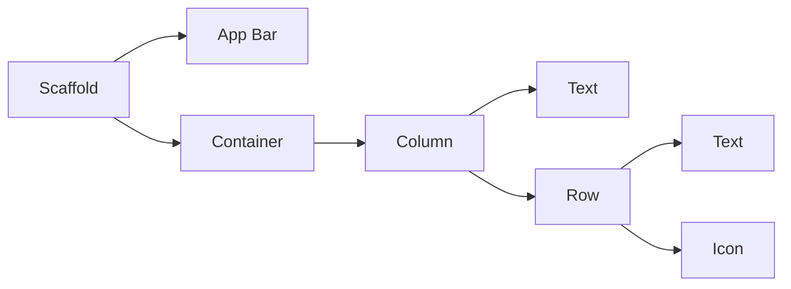
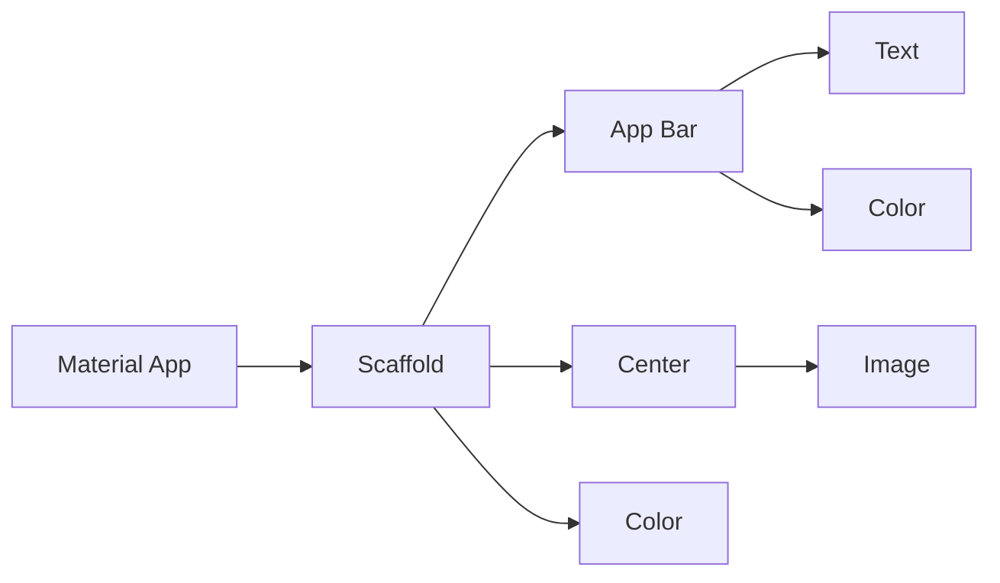

Flutter Framework App Development

Here are my simplified notes for Flutter App Development, using DART programming language.      

Used for building iOS & Android Phone Apps, Web Apps, etc.

# Table of Contents

1. **Introduction**
   1. Why Flutter
   2. The Anatomy of a Flutter App
   3. Setup & Installation
2. **Section 2: Creating an App - First Steps**
   1. MaterialApp Class
   2. Formatting Code
   3. Hot Reload Feature
   4. Scaffolding a Flutter App
   5. Planning the Structure of a Flutter App
   6. Adding Custom App Icons
   7. Testing your Flutter App
   8. External Resources to Use in App
   9. Dart SDK
3. **Section 3: Using Flutter Layout UI**
   1. Container Widget
   2. Column & Row Widgets
   3. Adding Custom Fonts
   4. Icons Widget
   5. Card Widget
   6. Divider Widget
   7. Expanded Widget
   8. URL Launcher
   9. Layout Tips
4. **Section 4: Handling States & Functions**
   1. Buttons Widgets
   2. Functions
   3. Variables
   4. Stateful Widget
   5. Handling Exceptions & Errors
5. **Section 5: Intermediate Flutter UI**
   1. sdas
   2. 2sdasd
   3. sdasd
6. **Section 6: Using APIs**
   1. HTTP Requests
7. **Section 7: Animations**
   1. Hero Animation
8. **Section 8: Flutter State Management**
   1. Local State
   2. Global State
9. **Section 9: Firebase**
10. **Section 10: Flutter App Architecture Patterns**
11. Publishing your Flutter Application**
    1. Android
    2. iOS
12. **Flutter Development Essentials**
   13. Flutter Packages
   14. 
15. **Dart Language**
    1. Print to Console
    2. Functions
    3. Data Types & Variables
    4. String Interpolation
    5. Classes
    6. Enumeration
    7. Ternary Operations
    8. Functions as First Order Objects
    9. Useful Libraries
16. **Other Cool Open-Source Flutter Apps**
17. ....

<br>

****

<br/>


# Section 1: Introduction to Flutter Framework

## Why Flutter?

- Used for building IOS Apps, Android Apps, Web Apps.

- **One Codebase** for both IOS and Android App development (Only need to maintain this one codebase for any changes/updates to app)     

  > Only need to know one language - Dart      
  >
  > Dart is used to build phone apps (Flutter), Web Apps (Hummingbird)

- Good support over **apps of different screen sizes** (phones, tablets, tv screens, etc....)     

  > This is important as there will be too many screen sizes to support manually:      
  >
  > Apple: ipadpro, ipadair, phones.....      
  >
  > Android: Open-sourced - meaning anyone can create their own smart devices with whatever screen size

- Flexible Layout System

  > Flutter is a UI Toolkit that makes it easy for developers to design beautiful interfaces for all sorts screen sizes and devices.      
  >
  > Comes with many pre-built widgets to use       
  >
  > 

- It is all about the **Widget**-based development for flutter

- **Hot Reload system**: Seeing your UI changes almost immediately as soon as you click "save" - way faster development

- For deeper development, you get to see the **original source code** of widgets etc. as Flutter is Open-Source      

  Benefits: You are aware of the exact behavior of components and you can create your own components based off on the original source code.

  > Such things are a mystery for many iOS components.

## The Anatomy of a Flutter App

Everything inside a Flutter App are **widgets** - you are building widgets upon widgets

- Imagine the widget tree



- Scaffold is the base blank screen for the app
- AppBar is a pre-built widget that looks and acts like an app bar
- Container is a box that holds widgets inside it
- Column contains a list of widgets that scroll vertically - arranged on top of one another
- Row contains a list of widgets that scroll horizontally - arranged side by side of  one another

## Setup & Installation

##### Code editor

 Android Studio, Visual Studio Code.      

Preferred to use Android Studio as its easier to work with emulator and android packages. Some tools are specially developed for Android Studio.

##### Testing Android Apps from Flutter

Easy to use physical Android phones, or Android Emulators

##### Testing iOS Apps from Flutter

You will need a mac to test! (security reasons from Apply - Code Signing). Even for the iOS Simulator.

<br/>

Can try using **Codemagic** to "Build, test and deliver your Flutter apps in record time". - Continuous integration and delivery for Flutter Apps

<br/>

#### Installing Flutter

1. Go to Flutter website and install Flutter sdk: https://flutter.dev/docs/get-started/install/windows.

   > Note: Install in a file path that does not require elevated privileges. Recommended C:\src\flutter

2. Add File Path for Flutter

   For windows: Edit environment variables for your account --add location of bin folder

   ```
   Once done, you should be able to check this in your Command Prompt:
   
   flutter --version
   ```

3. Use flutter doctor to check that set up is good for flutter to work well

   ``` 
   Type in Command Prompt:
   flutter doctor
   ```

   > This is quite a useful tool as it checks all the dependencies, including whether you have downloaded Flutter plugin on android studio

4. Install Flutter Plugin on Android Studio

   Go to Settings > Plugins       

   Type in 'Flutter' and install it. Afterwards you will have to restart the IDE for plugin changes to take place.     

   Once this is done, you should be able to see "Start a new Flutter project" in you welcome screen or when you create a new project     

5. Download a Phone Emulator (if you do not have one yet)

   Open AVD manager > Choose a phone (recommended Nexus series) > Choose an OS     

   > For Emulated Performance: Graphics, recommended to use Hardware for faster performance.

**You are set up to use flutter and dart to develop flutter apps for Android!**

<br/>


# Section 2: Creating an App - First Steps

## MaterialApp Class

This is an important app to use as your app's scaffold.     

Taps straight into the **Material Design** that is being used by many app creators - standard design templates that can be used straight.          

https://material.io/design/

Built by Google     

#### Basic barebones app with MaterialApp:

```
import 'package:flutter/material.dart';

void main() => runApp(MaterialApp(home: Text('Hello world')));
```

#### Center Widget

To center other widgets, you can place them into a **Center Widget**

> Note how Flutter is made up of Widgets ---including this centering behaviour

```
import 'package:flutter/material.dart';

void main() => runApp(MaterialApp(home: Center(child: Text('Hello world'))));
```

## Formatting Code

#### Using in-built re-formatter: **"Reformat Code with dartfmt"**     

BUT to use this, we need to add a comma at each parenthesis of hierarchy to signal to dartfmt formatter of the hierarchy of widgets. ie.     

###### FROM THIS:   

```
import 'package:flutter/material.dart';

void main() => runApp(MaterialApp(home: Center(child: Text('Hello world'))));
```

###### TO THIS:

```
import 'package:flutter/material.dart';

void main() => runApp(MaterialApp(home: Center(child: Text('Hello world'),),),);

```

###### Click "Reformat Code with dartfmt"

```
import 'package:flutter/material.dart';

void main() => runApp(
      MaterialApp(
        home: Center(
          child: Text('Hello world'),
        ),
      ),
    );

```

> This will automatically arrange and format code in a very readable format.

###### Change the fat arrow '=>' to curly braces '{}' for better readability

```
import 'package:flutter/material.dart';

void main() { runApp(
      MaterialApp(
        home: Center(
          child: Text('Hello world'),
        ),
      ),
    );
}
```

## Hot Reload Feature

One of the key features of Flutter: 

### **Hot Reload**    

Allows almost instant changes to UI to be seen (but there are caveats for this useful feature)     

> Ie. Changes can only be seen for Hot Reload for a few instances - not for all kinds of changes

#### Changes must be inside a Flutter Stateless or Stateful widget

We can create our own **StatelessWidget** by using the boilerplate code for building a stateless widget       

Shortcut: type *stless* and select shortcut

```
class MyApp extends StatelessWidget {
  @override
  Widget build(BuildContext context) {
    return Container();
  }
}
```

We just have to throw everything that we coded for the app into this StatelessWidget.

```
import 'package:flutter/material.dart';

void main() { runApp(
  MyApp()
    );
}
class MyApp extends StatelessWidget {
  @override
  Widget build(BuildContext context) {
    return MaterialApp(
      home: Center(
        child: Text('Hello world'),
      ),
    );
  }
}

```

Now any changes that you do under this stateless widget of MyApp will be reflected using **Hot Reload **     

Almost 'live' changes - updates in fractions of seconds

> Saves us a lot of time by recompiling and building app - especially for huge apps.     
>
> Especially if you make a lot of minute UI changes.

Note: You will not lose the in-app data.

### Hot Restart

If you want to test the app from the start    

It acts like Hot Reload, but it refreshes whatever in-app data/progress you have done.

## Scaffolding a Flutter App

Place whatever you need onto the scaffold - like a background to the app.    

https://api.flutter.dev/flutter/material/Scaffold-class.html       

```
import 'package:flutter/material.dart';

void main() {
  runApp(MyApp());
}

class MyApp extends StatelessWidget {
  @override
  Widget build(BuildContext context) {
    return MaterialApp(
      home: Scaffold(),
    );
  }
}
```

### Components you can add: 

- appBar - a component (properties: title, backgroundColor,....)

- backgroundColor

- body

- drawer

- floatingActionButton

- bottomNavigationBar

- ... etc

  > visit https://api.flutter.dev/flutter/material/Scaffold-class.html#instance-properties  to find more

eg for appBar:

```
import 'package:flutter/material.dart';

void main() {
  runApp(MyApp());
}

class MyApp extends StatelessWidget {
  @override
  Widget build(BuildContext context) {
    return MaterialApp(
      home: Scaffold(
        appBar: AppBar(
          title: Text('I AM RICH'),
          backgroundColor: Colors.blueGrey[900],
        ),
      ),
    );
  }
}
```

> Useful to use the Material Colors from MaterialDesign.     
>
> https://material.io/design/color/the-color-system.html#tools-for-picking-colors      
>
> We can do this as we are using a MaterialApp.

### Body

This is where the main content of the scaffold class is placed at.

##### Image widget

Note that there are many different types of libraries for Image. Need to choose the right one.     

https://api.flutter.dev/flutter/widgets/Image-class.html

Properties:      

- image
- repeat
- height
- width
- color
- alignment
- ....etc

```
import 'dart:ui';

import 'package:flutter/material.dart';

void main() {
  runApp(MyApp());
}

class MyApp extends StatelessWidget {
  @override
  Widget build(BuildContext context) {
    return MaterialApp(
      home: Scaffold(
        backgroundColor: Colors.blueGrey,
        appBar: AppBar(
          title: Text('I AM RICH'),
          backgroundColor: Colors.blueGrey[900],
        ),
        body: Image(
          image: NetworkImage('https://images.unsplash.com/photo-1575616652983-23b9a2987012?ixlib=rb-1.2.1&ixid=eyJhcHBfaWQiOjEyMDd9&auto=format&fit=crop&w=634&q=80'),
        ),
      ),
    );
  }
}

```

What if you want to center an image?

> Tip: Click on Image widget and use Alt+Enter: "Wrap with Center"     
>
> Flutter will automatically wrap the whole image widget in a Center widget
>
> ```
> import 'dart:ui';
> 
> import 'package:flutter/material.dart';
> 
> void main() {
>   runApp(MyApp());
> }
> 
> class MyApp extends StatelessWidget {
>   @override
>   Widget build(BuildContext context) {
>     return MaterialApp(
>       home: Scaffold(
>         backgroundColor: Colors.blueGrey,
>         appBar: AppBar(
>           title: Text('I AM RICH'),
>           backgroundColor: Colors.blueGrey[900],
>         ),
>         body: Center(
>           child: Image(
>             image: NetworkImage('https://images.unsplash.com/photo-1575616652983-23b9a2987012?ixlib=rb-1.2.1&ixid=eyJhcHBfaWQiOjEyMDd9&auto=format&fit=crop&w=634&q=80'),
>           ),
>         ),
>       ),
>     );
>   }
> }
> 
> ```

###### To use Image from our local app folder:

We have to go to pubspec.yaml and uncheck the Assets section

```
 # To add assets to your application, add an assets section, like this:
 # assets:
  #  - images/a_dot_burr.jpeg
  #  - images/a_dot_ham.jpeg
```

Insert the correct directory and file we want to use:

```
# To add assets to your application, add an assets section, like this:
  assets:
    - images/diamondImage.jpeg
```

This tells our flutter app about this particular asset - after which we can use this asset anywhere in our flutter app, eg main.dart

<br/>

**CTRL + Q** on widget to see **QUICK DOCS** on more info about the widget

<br/>

## Planning the Structure of a Flutter App

There are many tools that can be used to plan the structure of any app, not just flutter app. It is essentially like a diagram or a flowchart to see the hierarchy of widgets for flutter app.     

Can use www.draw.io  to plan.    

Note for the app above:     



> THE POWER OF FLUTTER APP - LEVERAGING THE POWER OF PRE-BUILT WIDGETS FROM FLUTTER TO BUILD IOS & ANDROID APPS:     
>
> All of these in under 30 lines of written code

## Adding Custom App Icons

Go to www.appicon.co     

Good platform to generate app icons for different devices: iPhone, iPad, Android, etc...       

This generates all the required files and formats for android and ios

###### Android

Go to android>app>src>main>res     

Delete all existing mipmap folders and copy the generated mipmap folders in.    

Make sure the names of the icons in the mipmap folders must be "ic_launcher"    

> Note: Recent designs of Android Icons are Circular style         
>
> How to resize/reformat style:       
>
> Go to res folder and create new Image Asset      
>
> Go to **Path** and pick the image of the icon you want       
>
> Manually resize every app icon you want so that it looks good.     
>
> This will manually replace all the existing app icons you have in your mipmap folders.

###### iOS

Go to ios>Runner>Assets.xcassets     

Delete Assets.xcassets folder and copy the generated Assets.xcassets folder in.     

<br/>

> All your App Icons for Android and iOS are updated with the new one!!

## Testing your Flutter App

### Android

###### Enable Developer Mode

Go to Settings>About Phone>Software Information      

Keep tapping on Build number until it says you have enabled developer mode      

###### Enable USB Debugging

Go to Settings> Developer Options       

Enable USB debugging     

###### Connect Your Phone with USB

Check "Always allow from this computer" to save much hassle

###### Run App from Android Studio

On Android Studio, select your phone instead of the emulator phone     

Load app into your phone!


## External Resources to Use in App

- www.icons8.com

  Beautiful Illustrations and Icons by artists

- www.vecteezy.com

  larger list of icons

- www.canva.com

  > Remember to credit the artworks from artists


## Dart SDK

### Selecting Dart SDK Path

Sometimes, the Dart SDK path may not be specified if you clone from other projects.     

You have to manually specify from the folder you have saved the flutter folder in.

```
C:\src\flutter\flutter\bin\cache\dart-sdk
```

For new projects, packages may not have been installed/set up properly.

*Get dependencies* to automatically install the required dependencies to run the project

<br/> 

# Section 3: Using Flutter Layout UI

Go to [Flutter Layout Widgets](https://flutter.dev/docs/development/ui/widgets/layout) to read up on documentation on any new layout widget you come across before using them.    

Good summary [Flutter Layout Cheatsheet](https://medium.com/flutter-community/flutter-layout-cheat-sheet-5363348d037e)

## Container Widget

Essentially a layout box - similar to the term 'div' in web dev.

> Note:       
>
> Containers with no children try to be as big as possible unless the incoming constraints are unbounded        
>
> Containers with children size themselves to their children - something **different **      
>
> The width, height and constraints arguments to the constructor override this.

### SafeArea Widget

If we do not wrap our main body content inside a SafeArea widget, contents may spill over to the top bar where our android icons are (time, battery status etc.) as well as the bottom especially for iPhones.     

We can  Alt + Enter and **Wrap with Widget** to the container.     

Afterwards, change the name of the widget to use the '**SafeArea**' widget

### Setting Size 

- height

- width

- margin       

  ```
  margin: EdgeInsets.all(10.0),
  ```

  ```
  margin: EdgeInsets.symmetric(vertical: 50.0, horizontal: 30.0),
  ```
  ```
  margin: EdgeInsets.fromLTRB(10.0, 20.0, 30.0, 5.0),
  ```
   ```
  margin: EdgeInsets.only(left: 10.0),
   ```
  
- padding       

  Same as margin above

  ```
  padding: padding: EdgeInsets.all(20.0),
  ```

Check sizing with Flutter inspector > Margin Inspector       

Summary:

```
import 'package:flutter/material.dart';

void main() {
  runApp(MyApp());
}

class MyApp extends StatelessWidget {
  @override
  Widget build(BuildContext context) {
    return MaterialApp(
      home: Scaffold(
        backgroundColor: Colors.blue,
        body: SafeArea(
          child: Container(
            height: 100.0,
            width: 100.0,
            margin: EdgeInsets.only(left: 10.0),
            padding: EdgeInsets.all(20.0),
            color: Colors.white,
            child: Text('Hello'),
          ),
        ),
      ),
    );
  }
}

```


<br/>

Note layout widgets like Container are **Single-child**, meaning they can only contain 1 specified child. If there is a need for more, we need to use *Column or Row widgets*(see below)

<br/>

## Column & Row Widgets

Column and Row widgets are **Multi-child** layout widgets

### Column Widget

Add the children widgets under children

```
Column(
          children: <Widget>[    
          
          ] 
)
```

##### MainAxisSize

Change it to vary the size of the column

```
Column(
	mainAxisSize: MainAxisSize.min,
	children:....
)
```

If not default is the maximum size possible from top to bottom of phone.

##### VerticalDirection

Default: 

```
verticalDirection: VerticalDirection.down
```
Opposite direction:
```
verticalDirection: VerticalDirection.down
```

##### MainAxisAlignment

Default:

```
mainAxisAlignment:MainAxisAlignment.start
```
Aligned to the bottom:
```
mainAxisAlignment:MainAxisAlignment.end
```
Aligned with center:
```
mainAxisAlignment:MainAxisAlignment.end
```
Spaced evenly:
```
mainAxisAlignment:MainAxisAlignment.spaceEvenly
```
Space between (one top, one bottom, the rest spaced out):
```
mainAxisAlignment:MainAxisAlignment.spaceBetween
```
Cross Axis Alignment - End - children aligned towards the right horizontally (with respect to the largest child)
```
mainAxisAlignment:CrossAxisAlignment.end
```
Cross Axis Alignment - Stretch - Stretch all children across the screen - no need to manually adjust width to double.infinity for all children
```
mainAxisAlignment:CrossAxisAlignment.stretch
```

##### Sized Box

An empty div box that provides some spacing

```
SizedBox(
height: 20.0,
),
```


### Row Widget

Works the same as a Column Widget, but in the other direction - children arranged from left to right

##### CrossAxisAlignment.baseline

For children in a row, we can align their values to a baseline

- Set CrossAxisAlignment to **CrossAxisAlignment.baseline**

  ```
  crossAxisAlignment: CrossAxisAlignment.baseline,
  ```

- specify which **textBaseline** property

  ```
  textBaseline: TextBaseline.alphabetic,
  ```

```
Row(
                    mainAxisAlignment: MainAxisAlignment.center,
                    crossAxisAlignment: CrossAxisAlignment.baseline,
                    textBaseline: TextBaseline.alphabetic,
                    children: <Widget>[
                      Text(
                        '180',
                        style: kNumberTextStyle,
                      ),
                      Text(
                        'cm',
                        style: kLabelTextStyle,
                      ),
                    ],
                  ),
```

> This makes all the text align together.


## Adding Custom Fonts

### Use Google Fonts

- Go to https://fonts.google.com/ - free for commercial use
- Download the font that you want

- Create new folder called 'fonts'

- Update on pubspec:

  ```
   fonts:
    - family: Pacifico
      fonts:
         - asset: fonts/Pacifico-Regular.ttf
    - family: Source Sans Pro
      fonts:
         - asset: fonts/SourceSansPro-Regular.ttf
  ```

Use font under Text:

```
Text('Software Engineer',
              style: TextStyle(
                fontFamily: 'Source Sans Pro',
                color: Colors.blueGrey.shade200,
                fontSize: 20.0,
                letterSpacing: 2.5,
                fontWeight: FontWeight.w400,

              ),)
```

## Icons Widget

Icons are one of the most frequently used widget - buttons, boxes, etc.        

 We can find most of the Icons that we want at [Material Design Icons](https://material.io/resources/icons/?style=baseline)     

Useful Tool for Material Design: [Material Design Palette](https://www.materialpalette.com/)      

Find the Icon that you want on Material Icons, note the name and add into code

```
Container(
                child: Row(
                  children: <Widget>[
                    Icon(Icons.add_shopping_cart),
                  ],
                ),
              ),
```

Icons are better than Vectors as their properties are more flexible. Eg. you can change color, size, etc without decrease in quality

## Card Widget

This is a useful widget for many purposes - it is a better Container Widget, that makes it look way better      

For all the properties of a Card Widget: https://api.flutter.dev/flutter/material/Card-class.html

#### Properties

- shape
- elevation
- borderOnForeground
- color
- ....

> Note Card Widget does not have a padding property     
>
> Solution: Use **Padding Widget** as a child to the Card Widget

#### Padding Widget (used as child of Card Widget)

```
Card(
                color: Colors.white,
                margin: EdgeInsets.symmetric(vertical: 10.0, horizontal: 25.0),
                child: Padding(
                  padding: EdgeInsets.all(25.0),
                  child: Row(
                    children: <Widget>[
                      Icon(
                        Icons.phone,
                        color: Colors.grey[700],
                      ),
                    ],
                  ),
                ),
              ),
```

#### ListTile Widget (used as child of Card Widget)

https://api.flutter.dev/flutter/material/ListTile-class.html       

When you want to add these in a Card:      

- Icons
- Text

> "A single fixed-height row that typically contains some text as well as a a leading or training icon"

Properties of ListTile:

- leading

- title

- subtitle

- onTap

- trailing

- ....etc

  Using it in a card:

```
Card(
                color: Colors.white,
                margin: EdgeInsets.symmetric(vertical: 10.0, horizontal: 25.0),
                child: ListTile(
                  leading: Icon(
                    Icons.email,
                    color: Colors.grey[700],
                  ),
                  title:Text(
                    'daryll_wong@hotmail.com',
                    style: TextStyle(
                      color: Colors.blueGrey[900],
                      fontFamily: 'Source Sans Pro',
                      fontSize: 20.0,
                    ),
                  ),
                )
              ),
```

## Divider Widget

[Divider Widget](https://api.flutter.dev/flutter/material/Divider-class.html) is simply a useful divider line.     

Mainly used for Aesthetics

#### Properties

- thickness
- color
- height
- width

```
SizedBox(
                height: 20.0,
                width: 150.0,
                child: Divider(
                  color: Colors.white,
                  thickness: 1.0,
                ),
              ),
```

## Expanded Widget

### Problem:

**Overflowing** of images, widges etc

### What does it do:

The [Expanded Widget](https://api.flutter.dev/flutter/widgets/Expanded-class.html) "expands a child of a [Row](https://api.flutter.dev/flutter/widgets/Row-class.html), [Column](https://api.flutter.dev/flutter/widgets/Column-class.html), or [Flex](https://api.flutter.dev/flutter/widgets/Flex-class.html) so that the child fills the available space."      

Using an [Expanded](https://api.flutter.dev/flutter/widgets/Expanded-class.html) widget makes a child of a [Row](https://api.flutter.dev/flutter/widgets/Row-class.html), [Column](https://api.flutter.dev/flutter/widgets/Column-class.html), or [Flex](https://api.flutter.dev/flutter/widgets/Flex-class.html) expand to fill the available space along the main axis (e.g., horizontally for a [Row](https://api.flutter.dev/flutter/widgets/Row-class.html) or vertically for a [Column](https://api.flutter.dev/flutter/widgets/Column-class.html)). If multiple children are expanded, the available space is divided among them according to the [flex](https://api.flutter.dev/flutter/widgets/Flexible/flex.html) factor.      

An [Expanded](https://api.flutter.dev/flutter/widgets/Expanded-class.html) widget must be a descendant of a [Row](https://api.flutter.dev/flutter/widgets/Row-class.html), [Column](https://api.flutter.dev/flutter/widgets/Column-class.html), or [Flex](https://api.flutter.dev/flutter/widgets/Flex-class.html), and the path from the [Expanded](https://api.flutter.dev/flutter/widgets/Expanded-class.html) widget to its enclosing [Row](https://api.flutter.dev/flutter/widgets/Row-class.html), [Column](https://api.flutter.dev/flutter/widgets/Column-class.html), or [Flex](https://api.flutter.dev/flutter/widgets/Flex-class.html) must contain only [StatelessWidget](https://api.flutter.dev/flutter/widgets/StatelessWidget-class.html)s or [StatefulWidget](https://api.flutter.dev/flutter/widgets/StatefulWidget-class.html)s (not other kinds of widgets, like [RenderObjectWidget](https://api.flutter.dev/flutter/widgets/RenderObjectWidget-class.html)s).      

```
Expanded(
          child: Image(
            image: AssetImage('images/dice1.png'),
          ),
```

### Properties:

- child

- flex (how many 'size' it takes up ie. ratio)

  ```
  Row(
        children: <Widget>[
          Expanded(
            flex: 2,
            child: Image(
              image: AssetImage('images/dice1.png'),
            ),
          ),
          Expanded(
            child: Image(
              image: AssetImage('images/dice1.png'),
            ),
          ),
        ],
      );
  ```

  

- fit

- key

- ...


## URL Launcher

[URL Launcher](https://pub.dev/packages/url_launcher) is a dependency that helps to open URL

https://alligator.io/flutter/url-launcher/

### Open URL

#### Add Dependency in pubspec.yaml

```
dependencies:
  flutter:
    sdk: flutter
  url_launcher: ^5.2.5
```

#### Add function

**Use onTap/onPressed**      

(depending on which widget is used)

```
import 'package:flutter/material.dart';
import 'package:url_launcher/url_launcher.dart';

void main() {
  runApp(Scaffold(
    body: Center(
      child: RaisedButton(
        onPressed: _launchURL,
        child: Text('Show Flutter homepage'),
      ),
    ),
  ));
}

_launchURL() async {
  const url = 'https://flutter.dev';
  if (await canLaunch(url)) {
    await launch(url);
  } else {
    throw 'Could not launch $url';
  }
}
```

Or directly add function into widget: eg.       

##### Force to open with specific browser

```
ListTile(
  title: Text("Launch Web Page"),
  onTap: () async {
    const url = 'https://google.com';

    if (await canLaunch(url)) {
      await launch(url, forceSafariVC: false);
    } else {
      throw 'Could not launch $url';
    }
  },
),
```

##### Open with in-app browser (WebView)

```
const url = 'https://google.com';

if (await canLaunch(url)) {
  await launch(url, forceWebView: true);
} else {
  throw 'Could not launch $url';
}
```

### Open Google Maps

#### Save Coordinates

```
class HomePage extends StatelessWidget {
  final String lat = "37.3230";
  final String lng = "-122.0312";

  // ...
}
```

#### Add function

```
ListTile(
  title: Text("Launch Maps"),
  onTap: () async {
    final String googleMapsUrl = "comgooglemaps://?center=$lat,$lng";
    final String appleMapsUrl = "https://maps.apple.com/?q=$lat,$lng";

    if (await canLaunch(googleMapsUrl)) {
      await launch(googleMapsUrl);
    }
    if (await canLaunch(appleMapsUrl)) {
      await launch(appleMapsUrl, forceSafariVC: false);
    } else {
      throw "Couldn't launch URL";
    }
  },
),
```

### Open Telephone

#### Save Number

```
class HomePage extends StatelessWidget {
  final String lat = "37.3230";
  final String lng = "-122.0312";

  final String telephoneNumber = "01817658822";

  // ...
}
```

#### Add Function

```
ListTile(
  title: Text("Telephone"),
  onTap: () async {
    String telephoneUrl = "tel:$telephoneNumber";

    if (await canLaunch(telephoneUrl)) {
      await launch(telephoneUrl);
    } else {
      throw "Can't phone that number.";
    }
  },
),
```

## Layout Tips

1. ### Using Flutter Outline

   - You can open Flutter Outline to wrap a widget with other widgets easily
   - Remove wrapping widget, leaving contents
   - Move position of widget up and down
   - Add Padding

2. ### Using Alt + Enter

   - Similarly, you can also wrap a widget with other widgets easily in code
   - Remove wrapping widget, leaving contents
   - Move position of widget up and down
   - Add Padding

<br/>


# Section 4: Handling States & Functions

## Buttons Widgets

### Types of Button Widgets available:

[Types of Button widgets](https://flutter.dev/docs/development/ui/widgets/material) 

- ButtonBar *
- DropdownButton
- FlatButton
- IconButton *
- FloatingActionButton
- PopupMenuButton
- RaisedButton *

### FlatButton Widget (eg)

#### Function

It is a **Zero-elevation Button** (with **text label**) that reacts to touches by filling with color

> Note this widget has default left and right padding    
>
> Check for yourself in Flutter Inspector.

```
FlatButton(
              child: Image.asset('images/dice1.png'),
            ),
```

#### onPressed

Reading documentation, note that it expects **void VoidCallback()** function     

> Signature of callbacks that have **no arguments** and **return no data**

> kind of like an Anonymous function

```
Expanded(
            child: FlatButton(
              onPressed: (){
                print("Left button pressed.");
              },
              child: Image.asset('images/dice1.png'),
            ),
          ),
```


## Functions

```
ssdsadasd
```


## Variables

Note to save variables inside **build** if not **Hot Reload** will not cause any updates - Hot Reload only updates what is changed inside of build

```
class DicePage extends StatelessWidget {
  
  @override
  Widget build(BuildContext context) {
    var leftDiceNum = 1;
    var rightDiceNum = 1;

	return ....
	.....
```


## Stateful Widget

### Stateful Widget vs Stateless Widget - whats the difference

**Stateless**: State of widget is Immutable, no change. Not meant to have any changes, and stay consistent.     

**Stateful**: State of widget can change. Changes can be seen depending on state.

### Stateful Widget

Shortcut: type "stful"     

Same as Stateless widget, copy all the cut all the code that will be **changed due to diff states**, into the Stateless widget.     

Only difference is  the **setState()** method

#### setState() method

```
FlatButton(
              onPressed: () {
                setState(() {
                  leftDiceNum = 5;
                });
              },
              child: Image.asset('images/dice$leftDiceNum.png'),
            ),
```

> If setState() is not called for any changes, the app will not know that it needs to update the UI of the app accordingly.     
>
> Therefore whereever the app states will change, must use setState()

#### What happens? 

Inside setState(), the app sees what variable is changed. Afterwards, the app looks at the code and see where else is this variable used and will affect UI changes.


#### Passing Data in a Stateful Widget

```
class LocationScreen extends StatefulWidget {

  LocationScreen({this.locationWeather});

  final locationWeather;

  @override
  _LocationScreenState createState() => _LocationScreenState();
}

class _LocationScreenState extends State<LocationScreen> {
  @override
  void initState() {
    // TODO: implement initState
    super.initState();
    print(widget.locationWeather);
  }
  
  
  @override
  Widget build(BuildContext context) {
    return Scaffold(......
```

Note you can access the property of the LocationScreen Stateful Widget from the LocationScreen State via ' **widget**'

> Look at how locationWeather is retrieved through widget.locationWeather


## Handling Exceptions & Errors

### Try-Catch Block

Use Try-Catch-Final blocks to catch exceptions - that can be expected.     

This is important as it **prevents app crashes** from happening, due to various reasons that can be expected and hence can be prevented.

```
try{
	//Do something that might fail
	//If the code fails at any point in time here, jump to the catch block
}catch{
	//If there are exceptions, run this block of code.
	//Catch exceptions that occur.
}
```

How to use it:

```

try{
	String myString = 'abc';
	double myStringAsDouble = double.parse(myString);
	print(myStringAsDouble + 5);
} catch(err){
	print(e)
}

// Output:
// FormatException: Invalid double abc
```

Note that in **actual practice in Flutter**, we should do the same way as well - using Try-Catch block to handle the return statements

```
@override
Widget build(BuildContext context){
	String myMargin = 'abc';
	double myMarginAsDouble
	try{
		double myMarginAsDouble = double.parse(myString);
	}catch{
		myMarginAsDouble = 30.0;
	}
	
	return Scaffold(
		body: Container(
		margin: EdgeInsets.all(myMarginAsDouble)
		)
	)
}
```

OR you could use '??' - which is a ternary operator

```
@override
Widget build(BuildContext context){
	String myMargin = 'abc';
	double myMarginAsDouble
	try{
		double myMarginAsDouble = double.parse(myString);
	}catch(e){
		print(e)
	}
	
	return Scaffold(
		body: Container(
		margin: EdgeInsets.all(myMarginAsDouble ?? 30.0)
		)
	)
}
```

> For '??' this means that if myMarginAsDouble has a value, use it. If it is null, use the given value instead.


## Routing

How to navigate to different screens:    

### Using NamedRoutes

```
// in main.dart
void main() => runApp(PrivateChat());

class PrivateChat extends StatelessWidget {
  @override
  Widget build(BuildContext context) {
    return MaterialApp(
      debugShowCheckedModeBanner: false,
      theme: ThemeData.dark().copyWith(
        textTheme: TextTheme(
          body1: TextStyle(color: Colors.black54),
        ),
      ),
      //home: WelcomeScreen(), ---cannot use this if you are using initial route.
      initialRoute: 'welcome_screen',
      routes: {
        'welcome_screen' : (context)=> WelcomeScreen(),
        'login_screen' : (context)=> LoginScreen(),
        'registration_screen' : (context)=> RegistrationScreen(),
        'chat_screen' : (context)=> ChatScreen(),
      },
    );
  }
}

```

> BUT using string is not the best idea to name the route as it is very prone to errors.    
>
> Name this as an id inside the individual screen dart files.

```
//in welcome_screen.dart
class WelcomeScreen extends StatefulWidget {
  static const String id = 'welcome_screen';

  @override
  _WelcomeScreenState createState() => _WelcomeScreenState();
}

class _WelcomeScreenState extends State<WelcomeScreen> {
  @override
  Widget build(BuildContext context) {
    return Scaffold( ....
    ....
```

```
// in main.dart
void main() => runApp(PrivateChat());

class PrivateChat extends StatelessWidget {
  @override
  Widget build(BuildContext context) {
    return MaterialApp(
      debugShowCheckedModeBanner: false,
      theme: ThemeData.dark().copyWith(
        textTheme: TextTheme(
          body1: TextStyle(color: Colors.black54),
        ),
      ),
      //home: WelcomeScreen(), ---cannot use this if you are using initial route.
      initialRoute: WelcomeScreen.id,
      routes: {
        WelcomeScreen.id : (context)=> WelcomeScreen(),
        'login_screen' : (context)=> LoginScreen(),
        'registration_screen' : (context)=> RegistrationScreen(),
        'chat_screen' : (context)=> ChatScreen(),
      },
    );
  }
}
```

> Realise how this is much better in terms of execution. Less prone to errors.

End product:

```
import 'package:flutter/material.dart';
import 'package:private_chat/screens/welcome_screen.dart';
import 'package:private_chat/screens/login_screen.dart';
import 'package:private_chat/screens/registration_screen.dart';
import 'package:private_chat/screens/chat_screen.dart';

void main() => runApp(PrivateChat());

class PrivateChat extends StatelessWidget {
  @override
  Widget build(BuildContext context) {
    return MaterialApp(
      debugShowCheckedModeBanner: false,
      theme: ThemeData.dark().copyWith(
        textTheme: TextTheme(
          body1: TextStyle(color: Colors.black54),
        ),
      ),
      //home: WelcomeScreen(), ---cannot use this if you are using initial route.
      initialRoute: WelcomeScreen.id,
      routes: {
        WelcomeScreen.id : (context)=> WelcomeScreen(),
        LoginScreen.id : (context)=> LoginScreen(),
        RegistrationScreen.id : (context)=> RegistrationScreen(),
        ChatScreen.id : (context)=> ChatScreen(),
      },
    );
  }
}

```

### Navigating to other screens using NamedRoutes

```
Navigator.pushNamed(context, LoginScreen.id);
```

```
MaterialButton(
                  onPressed: () {
                    //Go to login screen.
                    Navigator.pushNamed(context, LoginScreen.id);
                  },
                  minWidth: 200.0,
                  height: 42.0,
                  child: Text(
                    'Log In',
                  ),
                ),
```

> Use that **static id** variable that was defined.             
>
> Better than using pure plain *string paths* (url format)  eg '/login' - reduces error


## NamedRoutes (URL path format)

A less preferred format (but example is shown below)

```
void main() => runApp(PrivateChat());

class PrivateChat extends StatelessWidget {
  @override
  Widget build(BuildContext context) {
    return MaterialApp(
      debugShowCheckedModeBanner: false,
      theme: ThemeData.dark().copyWith(
        textTheme: TextTheme(
          body1: TextStyle(color: Colors.black54),
        ),
      ),
      //home: WelcomeScreen(), ---cannot use this if you are using initial route.
      initialRoute: '/',
      routes: {
        '/' : (context)=> WelcomeScreen(),
        '/login' : (context)=> LoginScreen(),
        '/registration' : (context)=> RegistrationScreen(),
        '/chat' : (context)=> ChatScreen(),
      },
    );
  }
}
```

> If we are doing this format/way, we **MUST** define one route with just **'/'** a simple forward slash nothing, if not the app will crash.


<br/>


# Section 5: Intermediate Flutter UI

## Flutter Themes

Coming up with standard themes that everyone can use across the app - a **standard way of styling** for your app.       

Usually this is set in the **main.dart** file       

There are already existing themes available eg ThemeData.dark(). But if you can create your custom one.      

Go to [Flutter themes](https://flutter.dev/docs/cookbook/design/themes) to see more details, and see what properties affect which widget.       

Or you can use existing themes, but update some colors: 

```
theme: ThemeData.dark().copyWith(
.........your updates
)
```

To custom change any other widget down the line to not follow the theme you originally set, 

you can do so by wrapping it inside a theme widget.

```
floatingActionButton: Theme(
        data: ThemeData.light(),
        child: FloatingActionButton(
          child: Icon(Icons.add),
        ),
      ),
```


## Custom Widgets

If you see yourself repeating a certain way of creating a widget at many places in your app, you should create a custom widget for it. This is done by "**Extract Widget**" method.        

On Flutter Outline tab, select the container you want to be refactored to a widget > Extract Widget > Give a custom widget name > Refactor        

> This will be very useful and save a lot of effort. Imagine if you have to change an attribute, you don't have to go to all places to change that.

```
class ReusableCard extends StatelessWidget {
  const ReusableCard({
    Key key,
  }) : super(key: key);

  @override
  Widget build(BuildContext context) {
    return Container(
      margin: EdgeInsets.all(15.0),
      decoration: BoxDecoration(
        color: Color(0xFF1D1E33),
        borderRadius: BorderRadius.circular(10.0),
      ),
    );
  }
}
```

Key class may not be needed. We only need it if there is a need to keep track of the widget on the screen - eg when it is moving or it is animating.

```
class ReusableCard extends StatelessWidget {
  ReusableCard({@required this.colour});

  final Color colour;

  @override
  Widget build(BuildContext context) {
    return Container(
      margin: EdgeInsets.all(15.0),
      decoration: BoxDecoration(
        color: colour,
        borderRadius: BorderRadius.circular(10.0),
      ),
    );
  }
}
```

> **@required** property makes it compulsory to provide     
>
> For widgets, recommended to create **constructor with curly braces**. So when using this widget, we have to indicate which property in particular too

###### Adding child property

```
class ReusableCard extends StatelessWidget {
  ReusableCard({@required this.colour, this.cardChild});

  final Color colour;
  final Widget cardChild;

  @override
  Widget build(BuildContext context) {
    return Container(
      child: cardChild,
      margin: EdgeInsets.all(15.0),
      decoration: BoxDecoration(
        color: colour,
        borderRadius: BorderRadius.circular(10.0),
      ),
    );
  }
}
```

> Sometimes, these widgets may not have the same child. So we can make this flexible as well.


## GestureDetector Widget

How do you make a widget react to a press?        

One way to do it is to wrap a widget in a FlatButton widget to have the onPressed property. But a FlatButton has its own styling already and if you have already more or less created a widget with your intended styling....         

Another way is to implement a **Gesture Detector** to detector other actions. eg onTap, onDoubleTap etc.       

There are a lot more cool properties that the [GestureDetector Widget](https://api.flutter.dev/flutter/widgets/GestureDetector-class.html) can detect:

### Properties

- onTap
- onDoubleTap
- onForcePressStart
- onLongPress
- onHorizontalDragEnd
- ....etc       

eg for onTap.

```
Expanded(
                  child: GestureDetector(
                    onTap: (){setState(() {
                      updateColour(1);
                    });},
                    child: ReusableCard(
                      colour: maleCardColour,
                      cardChild: IconContent(
                        icon: FontAwesomeIcons.mars,
                        label: 'MALE',
                      ),
                    ),
                  ),
                ),
```


## Slider Widget

We can use in-build [Material Design Slider](https://material.io/components/sliders/) with the [Slider Class](https://api.flutter.dev/flutter/material/Slider-class.html)

```
Slider(
                        value: height.toDouble(),
                        min: 120.0,
                        max: 220.0,
                        activeColor: Colors.red,
                        inactiveColor: Colors.grey,
                        onChanged: (double newValue) {
                          setState(() {
                            height = newValue.round();
                          });
                        },
                      ),
```

To have finer tuning of the colours and properties, we have to tap on the **SliderThemeData** as mentioned in its documentation in [Slider Class](https://api.flutter.dev/flutter/material/Slider-class.html)       

```
SliderTheme(
                    data: SliderThemeData(.................),
                    child: Slider(
                      value: height.toDouble(),
                      min: 120.0,
                      max: 220.0,
                      activeColor: Colors.white,
                      inactiveColor: Color(0xFF8D8E98),
                      onChanged: (double newValue) {
                        setState(() {
                          height = newValue.round();
                        });
                      },
                    ),
                  ),
```


 You don't have to override and specify everything inside of SliderThemeData. If you just want to finetune a few details, you can use SliderTheme.of(context).copyWith().    

```
SliderTheme(
                    data: SliderTheme.of(context).copyWith(
                      activeTrackColor: Colors.white,
                      inactiveTrackColor: Color(0xFF8D8E98),
                      overlayColor: Color(0x29EB1555),
                      thumbColor: Color(0xFFEB1555),
                      thumbShape:
                          RoundSliderThumbShape(enabledThumbRadius: 15.0),
                      overlayShape: RoundSliderOverlayShape(overlayRadius: 30.0),
                    ),
                    child: Slider(
                      value: height.toDouble(),
                      min: 120.0,
                      max: 220.0,
                      onChanged: (double newValue) {
                        setState(() {
                          height = newValue.round();
                        });
                      },
                    ),
                  ),
```


## TextField widget

Input text field that is fully customizable.

``` 
TextField(
                  style: TextStyle(
                    color: Colors.black,
                  ),
                  decoration: kTextFieldInputDecoration
                ),
```

```
const kTextFieldInputDecoration = InputDecoration(
  filled: true,
  fillColor: Colors.white,
  icon: Icon(
    Icons.location_city,
    color: Colors.white,
  ),
  hintText: 'Enter City Name',
  hintStyle: TextStyle(
    color: Colors.grey,
  ),
  border: OutlineInputBorder(
    borderRadius: BorderRadius.all(
      Radius.circular(10.0),
    ),
    borderSide: BorderSide.none,
  ),
);
```

> Baseline template text field to work upon


## ListView Widget

[ListView ](https://api.flutter.dev/flutter/widgets/ListView-class.html) widget is the typical widget that displays  a list of same widgets.

```
...
ListView(
      children: <Widget>[
        TaskTile(taskTitle: tasks[0].name, isChecked: tasks[0].isDone),
        TaskTile(taskTitle: tasks[1].name, isChecked: tasks[1].isDone),
        TaskTile(taskTitle: tasks[2].name, isChecked: tasks[2].isDone),
      ],
    );
```

However, in most cases, you do not want to hardcode the list of widgets. You want this to be built depending on the list of values being input - you use the **ListView.builder**


### ListView Builder

This is a more efficient way of displaying the list of items as imagine if the list is infinitely long. If the ListView has to load all the data at once, it will take up a lot of resources. For **ListView Builder**, it will only build & render what is needed to be *shown visibly* (the parts that we see) - this will save a lot of resources.

```
@override
  Widget build(BuildContext context) {
    return ListView.builder(
      itemBuilder: (context, index) {
        return TaskTile(
          taskTitle: tasks[index].name,
          isChecked: tasks[index].isDone,
        );
      },
      itemCount: tasks.length,
    );
  }
```

> Look at how this is being implemented. Everything is dynamic with the use of index. ListView Builder saves a lot of hassle and inefficiency


## Composition over Inheritance

For Swift/Java if we want to create custom widgets, we usually inherit from existing ones and override some of the properties.      

But for Flutter, **Composition is preferred over Inheritance**      

What this means is to create widgets **from scratch using the simplest widgets** possible: ***Composing Widgets***        

This is so Flutter is able to keep our components' performance and keep our apps fast    

We can build real custom widgets from this way because everything in Flutter is open-source - meaning we can see how widgets are being created and we can create our own.     

For eg we can dig deeper into FloatingActionButton documentation to see how is it created - it used RawMaterialButton. Similarly if we want to create our own FAB, we can use RawMaterialButton and do it ourself.


## Routing

If you want to navigate to a different page/screen, we need to use [Navigation](https://flutter.dev/docs/cookbook/navigation/navigation-basics).     

Read the documentation to find out more. Note that this makes use of **Stack & Pop** idea.

### Navigator.push()

```
// Within the `FirstRoute` widget
onPressed: () {
  Navigator.push(
    context,
    MaterialPageRoute(builder: (context) => SecondRoute()),
  );
}
```

Need to provide:

- **context** 

  which is the current build context of current screen - which is the current location of widget in the overall widget tree (look at Flutter Outline)

- **route**

  the *material page route* to build the second route

For routing from Screen1 to Screen2:

```
class Screen1 extends StatelessWidget {
  @override
  Widget build(BuildContext context) {
    return Scaffold(
      appBar: AppBar(
        backgroundColor: Colors.red,
        title: Text('Screen 1'),
      ),
      body: Center(
        child: RaisedButton(
          color: Colors.red,
          child: Text('Go Forwards To Screen 2'),
          onPressed: () {
            Navigator.push(
              context,
              MaterialPageRoute(builder: (context) {
                return Screen2();
              }),
            );
          },
        ),
      ),
    );
  }
}
```

> Why **MaterialPageRoute**? MaterialPageRoute helps to control the *page animation* when we are routing between pages. Eg if I'm switching to another page, for android it is a move right animation and for ios it is a move top animation.

> Note I can pass info to Screen2 too! Just add in the properties into Screen2()  just like how you would initiate a class.

### Navigator.pop()

Note this works like a **Stack**     

Navigator.pop() basically removes the current page from the stack and returns the page remaining on the stack which is the previous page.

```
// Within the SecondRoute widget
onPressed: () {
  Navigator.pop(context);
}
```

Eg. Routing from Screen2 back to Screen1

```
class Screen2 extends StatelessWidget {
  @override
  Widget build(BuildContext context) {
    return Scaffold(
      appBar: AppBar(
        backgroundColor: Colors.blue,
        title: Text('Screen 2'),
      ),
      body: Center(
        child: RaisedButton(
          color: Colors.blue,
          child: Text('Go Back To Screen 1'),
          onPressed: () {
            Navigator.pop(context);
          },
        ),
      ),
    );
  }
}
```


### Named Routes

What if you need to "navigate to the same screen in many parts of your app, this approach can result in code duplication. The solution is to define a *named route*, and use the named route for navigation."

> If you have to navigate to the same screen and write this code at many different places, there is an easier way of doing this, using **named routes**    
>
> https://flutter.dev/docs/cookbook/navigation/named-routes

```
import 'package:flutter/material.dart';
import 'screen1.dart';
import 'screen0.dart';
import 'screen2.dart';

void main() => runApp(MyApp());

class MyApp extends StatelessWidget {
  @override
  Widget build(BuildContext context) {
    return MaterialApp(
      initialRoute: '/', // same as home: Screen0(),
      routes: {
        '/': (context) => Screen0(),
        '/first': (context) => Screen1(),
        '/second': (context) => Screen2(),
      },
    );
  }
}
```

Now to push to a different screen, we use **Navigator.pushNamed()**

```
RaisedButton(
              color: Colors.red,
              child: Text('Go To Screen 1'),
              onPressed: () {
                Navigator.pushNamed(context, '/first');
              },
            ),
```


## Widget Lifecycles

Different states have different lifecycles - for different purposes.

### Stateless Widget

Stateless only has one important lifecycle - **build** method.

```
class  extends StatelessWidget {
  @override
  Widget build(BuildContext context) {
    return Container();
  }
}
```


### Stateful Widget

Stateful widget has the **state** object that helps to keep track of the state of widgets - keep track of variables, eg configurations, properties of widgets - use setState() to update app

```
class RandomStatefulWidget extends StatefulWidget {
  @override
  _State createState() => _State();
}

class _State extends State<RandomStatefulWidget> {
  
  @override
  void initState() {
    // TODO: implement initState
    super.initState();
  }
  
  @override
  Widget build(BuildContext context) {
    return Container();
  }
  
  @override
  void deactivate() {
    // TODO: implement deactivate
    super.deactivate();
  }
}
```

There are 3 important methods for stateful widgets:

- **initState** - called when state is initialised
- **build** - when widgets are built and shows up on screen
- **deactivate** - called when this stateful widget is destroyed


## Specific UI for different OS platforms

``` 
import 'dart:io' show Platform;
```

> Only the Platform.dart file is needed to check which platform OS is running  - android, iOS etc.

### Which UI to display

Create Intermediate function to select which UI to display - depending on phone OS used

```
Widget getPicker(){
    if(Platform.isIOS){return iOSPicker();}
    else if (Platform.isAndroid){return androidDropdown();}
  }
```

Of course, iOSPicker() and androidDropdown() are functions created that returns widgets

```
CupertinoPicker iOSPicker(){
    List<Text> pickerItemsList = [];
    for (String currency in currenciesList) {
      pickerItemsList.add(Text(
        currency,
        style: TextStyle(color: Colors.white),
      ));
    }

    return CupertinoPicker(
      backgroundColor: Colors.lightBlue,
      itemExtent: 32.0,
      onSelectedItemChanged: (selectedIndex) {
        print(selectedIndex);
      },
      children: pickerItemsList,
    );

  }
```

```
DropdownButton<String> androidDropdown() {
    List<DropdownMenuItem<String>> dropdownItems = [];
    for (String currency in currenciesList) {
      //for (int i = 0; i < currenciesList.length; i++) {
      //String currency = currenciesList[i];
      var newItem = DropdownMenuItem(
        child: Text(currency),
        value: currency,
      );
      dropdownItems.add(newItem);
    }
    return DropdownButton<String>(
      value: selectedCurrency,
      items: dropdownItems,
      onChanged: (value) {
        setState(() {
          selectedCurrency = value;
        });
      },
    );
  }
```

Afterwards, we just need to use the getPicker() method which already helps us select which UI to show

```
Container(
            height: 150.0,
            alignment: Alignment.center,
            padding: EdgeInsets.only(bottom: 30.0),
            color: Colors.lightBlue,
            child: getPicker(),
          ),
```

Or do this in a single line of code:

```
Container(
            height: 150.0,
            alignment: Alignment.center,
            padding: EdgeInsets.only(bottom: 30.0),
            color: Colors.lightBlue,
            child: Platform.isIOS ? iOSPicker() : androidDropdown(),
          ),
```


<br/>


# Section 6: Using APIs

"An Application Programming Interface (API) is a set of commands, functions, protocols, and objects that programmers can use to **create software** or **interact with an external system**    

It provides developers with standard commands for performing **common operations** so they do not have to write the code from scratch - wikipedia"

> Side note, when we are using Flutter to create software, we can be considered as using an API as well.    
>
> But most of the time, most people refer **APIs to interaction with an external system**

API is an interface that dictates how you can interact with other program/server.     

-There are only *authorised ways* to interact, that is defined - read the documentation of the API.     

## HTTP Requests

### GET Request

The most used request is the **GET request** to retrieve data.

```
void getData() async {
    Response response = await get('http://samples.openweathermap.org/data/2.5/weather?lat=35&lon=139&appid=b6907d289e10d714a6e88b30761fae22');
    print(response.body);
  }
```

> Usually, the payload would be a **JSON formatted response** - use key-pair

### Status Codes

Status codes are a standard way of telling us the success of a request. Most well-known is 404, which is client error.

Check the list of codes [available](https://restfulapi.net/http-status-codes/)      

**1XX**: Informational | "Hold On"    

**2XX**: Success | "Here is your info"      

**3XX**: Redirection | "Go away you are not allowed"    

**4XX**: Client Error | "There is something wrong with me"

> Most likely I sent the wrong request url that doesnt exist      

**5XX**: Server Error | "There is something wrong with server..."


<br/>


# Section 7: Animations

## Hero Animation

[Hero Animation](https://flutter.dev/docs/development/ui/animations/hero-animations)  is a transition whereby state 1 and state 2 has shared element and you can see how that shared element transitions between the 2 states (or screens for most cases)        

You have to assign the **same tag** to this common element for both states.       

```
// Screen 1
...
Hero(
                  tag: 'logo',
                  child: Container(
                    child: Image.asset('images/logo.png'),
                    height: 60.0,
                  ),
                ),
                
                ...
```

``` 
// Screen 2
...
Hero(
              tag: 'logo',
              child: Container(
                height: 200.0,
                child: Image.asset('images/logo.png'),
              ),
            ),
            ...
```

> Both places are assigned the same tag of  'logo' - Hero widget will know how to transition, note how both has different heights


## Custom Animations

[Animation Controller ](https://api.flutter.dev/flutter/animation/AnimationController-class.html) is the main widget we can use to set custom animations - whatever we want.   

In general there are 3 things that you need to provide:

- A Ticker
- Animation Controller
- An Animation Value

```
// Extending welcomescreenstate with new ability to act as a ticker for a single animation
class _WelcomeScreenState extends State<WelcomeScreen> with SingleTickerProviderStateMixin{
....
```

```
// Animation Controller
class _WelcomeScreenState extends State<WelcomeScreen> with SingleTickerProviderStateMixin{

  AnimationController controller;

  @override
  void initState() {
    super.initState();
    controller = AnimationController(
      duration: Duration(seconds: 1),
      vsync: this,
    );
  }
```

> **vsync** tells us which is the ticker for the animation controller. '**this**' will refer to the welcomescreenstate itself.

```
// Set Animation Value
...
@override
  void initState() {
    super.initState();
    controller = AnimationController(
      duration: Duration(seconds: 1),
      vsync: this,
    );
    controller.forward();
  }
...
```

> 1 seconds is 60 ticks on the ticker.

Need to add setState to notify of changes.   

Use **controller.value**

```
@override
  void initState() {
    super.initState();
    controller = AnimationController(
      duration: Duration(seconds: 1),
      vsync: this,
    );
    controller.forward();
    controller.addListener((){
      setState(() {});
      print(controller.value);
    });
  }

  @override
  Widget build(BuildContext context) {
    return Scaffold(
      backgroundColor: Colors.red.withOpacity(controller.value),
      ...
```

You can also change the **upperBound** values

```
// Changing Upper Bound values of controller.value
...
@override
  void initState() {
    super.initState();
    controller = AnimationController(
      duration: Duration(seconds: 1),
      vsync: this,
      upperBound: 100.0,
    );
    controller.forward();
    controller.addListener(() {
      setState(() {});
      print(controller.value);
    });
  }
...
```


### Curved Animation Widget

If you dont want a linear change, but something that is varying, you can use the [Curved Animation Widget](https://api.flutter.dev/flutter/animation/CurvedAnimation-class.html)    

You can do normal curved changes, jumping changes etc. See the [collection of animations ](https://api.flutter.dev/flutter/animation/Curves-class.html) here and see the many different curves animations.

```
...
class _WelcomeScreenState extends State<WelcomeScreen>
    with SingleTickerProviderStateMixin {
  AnimationController controller;
  Animation animation;

  @override
  void initState() {
    super.initState();
    controller = AnimationController(
      duration: Duration(seconds: 1),
      vsync: this,
      //upperBound: 100.0,
    );

    animation = CurvedAnimation(parent: controller, curve: Curves.decelerate); //with curves, we cannot have an upperBound that is > 1

    controller.forward();
    controller.addListener(() {
      setState(() {});
      print(animation.value);
    });
  }
  ....
```

> Note if you are using animation.value, the upperbound of animation controller **cannot be more than 1**.


### Looping Animations

Check AnimationStatus. **AnimationStates.completed** is when forward animation is done and **AnimatonStatus.dismissed** is when reverse animation is done.     

For looping, check statuses and apply forward & reverse animations

``` 
@override
  void initState() {
    super.initState();
    controller = AnimationController(
      duration: Duration(seconds: 1),
      vsync: this,
      //upperBound: 100.0,
    );

    animation = CurvedAnimation(parent: controller, curve: Curves.decelerate); //with curves, we cannot have an upperBound that is > 1

    controller.forward();
    animation.addStatusListener((status){
      if(status == AnimationStatus.completed){
        controller.reverse(from: 1.0);
      }else if (status == AnimationStatus.dismissed){
        controller.forward();
      }
    });
    
    

    controller.addListener(() {
      setState(() {});
      print(animation.value);
    });
  }
```


### Dispose Animation Controller

Note that animation controller will still live and waste resources regardless if you change screens - if you do not dispose of them.

```
...
@override
  void dispose() {
    controller.dispose();
    super.dispose();
  }
...
```


## Tween Animation

There are many tween animations that allows the change of property gradually, eg color... etc

visit [Tween](https://api.flutter.dev/flutter/animation/Tween-class.html) to find out more.      

There is always a **beginning value** and an **end value**

```
...
@override
  void initState() {
    super.initState();
    controller = AnimationController(
      duration: Duration(seconds: 1),
      vsync: this,
      //upperBound: 100.0,
    );

    animation = ColorTween(begin: Colors.red, end: Colors.blue).animate(controller);

    controller.forward();

    controller.addListener(() {
      setState(() {});
      print(animation.value);
    });
  }
...
```

```
// Using the ColorTween value
....

@override
  Widget build(BuildContext context) {
    return Scaffold(
      backgroundColor: animation.value,
     ...
```


<br/>


# Section 8: Flutter State Management

States control what the UI changes are. Some UI changes & states are localized, while some are related to more than one. There are 2 states - **Local State** & **Global State **    


## Local State

Local states are localized pieces of data that is not needed elsewhere across the app.

> eg page numbers, clicking of checkboxes

It is easy to use a setState() to toggle the value of the variable - with a **Stateful Widget**

```
var isChecked = false;
...
...

setState((){
	isChecked = true;
})
```


## Global State

Global States are pieces of data that is being kept and used across different parts of the app

> For eg: If you click on a checkbox, besides checking off the checkbox, you also want the text to be striked off - notice that this variable has to be shared and use by the Text widget too.

This is an example of how the isChecked variable will have effect on the checkbox and text widgets

```
import 'package:flutter/material.dart';

class TaskTile extends StatefulWidget {
  @override
  _TaskTileState createState() => _TaskTileState();
}

class _TaskTileState extends State<TaskTile> {
  bool isChecked = false;

  void checkboxCallback(bool checkboxState) {
    setState(() {
      isChecked = checkboxState;
    });
  }

  @override
  Widget build(BuildContext context) {
    return ListTile(
      title: Text(
        'This is a task',
        style: TextStyle(
            decoration: isChecked ? TextDecoration.lineThrough : null),
      ),
      trailing: TaskCheckbox(
        checkboxState: isChecked,
        toggleCheckboxState: checkboxCallback,
      ),
    );
  }
}

class TaskCheckbox extends StatelessWidget {
  final bool checkboxState;
  final Function toggleCheckboxState;

  TaskCheckbox({this.checkboxState, this.toggleCheckboxState});

  @override
  Widget build(BuildContext context) {
    return Checkbox(
      activeColor: Colors.lightBlueAccent,
      value: checkboxState,
      onChanged: toggleCheckboxState,
    );
  }
}
```

> Also note that the checkbox widget is a **Stateless Widget** housed in a **Stateful widget**      
>
> In this case, the *variables inside the stateless widget* has to be **declared final** with a constructor so that every time the variable changes, the stateless widget will be rebuilt again, to reflect the changes.


<br/>

# Section 9: Firebase

1) Create firebase project

2) Add Android/iOS app (follow respective instructions)

3) Add plugins that you intend to use      

See the list of plugins [here](https://github.com/FirebaseExtended/flutterfire)      

Common plugins:

- [Firebase Core](https://pub.dev/packages/firebase_core)
- [Firebase Auth](https://pub.dev/packages/firebase_auth)
- [Cloud Firestore](https://pub.dev/packages/cloud_firestore)

## Firebase Auth

### Create Firebase Auth instance first:

```
class LoginScreen extends StatefulWidget {
  static const String id = 'login_screen';

  @override
  _LoginScreenState createState() => _LoginScreenState();
}

class _LoginScreenState extends State<LoginScreen> {
  final _auth = FirebaseAuth.instance;

  bool showSpinner = false;

  String email;
  String password;

.....
```

### Add sign in method:

```
RoundedButton(
                title: 'Log In',
                color: Colors.lightBlueAccent,
                onPressed: () async {
                  setState(() {
                    showSpinner = true;
                  });
                  try{
                    final user = await _auth.signInWithEmailAndPassword(email: email, password: password);
                    if(user != null){
                      Navigator.pushNamed(context, ChatScreen.id);
                    }
                    setState(() {
                      showSpinner = false;
                    });
                  }catch(e){
                    print(e);
                  }


                },
              )
```

### Adding a loading spinner:

```
class LoginScreen extends StatefulWidget {
  static const String id = 'login_screen';

  @override
  _LoginScreenState createState() => _LoginScreenState();
}

class _LoginScreenState extends State<LoginScreen> {
  final _auth = FirebaseAuth.instance;

  bool showSpinner = false;

  String email;
  String password;


  @override
  Widget build(BuildContext context) {
    return ModalProgressHUD(
      inAsyncCall: showSpinner,
      child: Scaffold(
        backgroundColor: Colors.white,
```

> Note you have to wrap the whole thing in a ModalprogressHUD (one eg [package](https://pub.dev/packages/modal_progress_hud))

> Must setState on where to start and where to end the spinner - see code above.


### Get Current User

In pages where the user is logged in, you have to get the current user that is being logged in.

```
class ChatScreen extends StatefulWidget {
  static const String id = 'chat_screen';

  @override
  _ChatScreenState createState() => _ChatScreenState();
}

class _ChatScreenState extends State<ChatScreen> {
  final _auth = FirebaseAuth.instance;
  FirebaseUser loggedInUser;

  final _firestore = Firestore.instance;

  String messageText;

  void getCurrentUser() async {
    try {
      final user = await _auth.currentUser();
      if (user != null) {
        loggedInUser = user;
        print(loggedInUser.email + " has logged in");
      }
    } catch (e) {
      print(e);
    }
  }
  ......
```

Do this once the screen gets initiated

``` 
...
@override
  void initState() {
    super.initState();
    getCurrentUser();
  }
  ...
```


## Cloud Firestore

**Cloud Firestore** is used as a **noSQL** database - which we can send and retrieve data from.

> firebase is a more simplified database which uses json file type. Firestore has more features.

All the keywords must be **exact**!

### To send data:

``` 
FlatButton(
                    onPressed: () {
                      //Send message
                      _firestore.collection('messages').add({
                        'text': messageText,
                        'sender': loggedInUser.email,
                      });
                    },
                    child: Text(
                      'Send',
                      style: kSendButtonTextStyle,
                    ),
                  ),
```


### To retrieve data:

#### One time snapshot (single data)

```
// example of retrieving data from 'messages' collection

void getMessages() async {
    final messages = await _firestore.collection('messages').getDocuments();
    for(var message in messages.documents){
      print
    }
  }
```

#### Retrieve as a stream of data (multiple data)

##### Receive as data only

```
void messagesStream() async {
    await for (var snapshot in _firestore.collection('messages').snapshots()) {
      for (var message in snapshot.documents) {
        print(message.data);
      }
    }
  }
```

> It will **keep listening for changes**, and if there is, there will be a new snapshot sent - which you can decide what you want to do with it

##### Receive as widget

But if you want to package this data received into a widget eg chat messages, you can use **StreamBuilder**

```
...
StreamBuilder<QuerySnapshot>(
              stream: _firestore.collection('messages').snapshots(),
              builder: (context, snapshot) {
                if (!snapshot.hasData) {
                  return Center(
                    child: CircularProgressIndicator(
                      backgroundColor: Colors.lightBlueAccent,
                    ),
                  );
                }
                  final messages = snapshot.data.documents;
                  List<Text> messageWidgets = [];
                  for (var message in messages) {
                    final messageText = message.data['text'];
                    final messageSender = message.data['sender'];

                    final messageWidget = Text('$messageText from $messageSender');
                    messageWidgets.add(messageWidget);
                  }
                  return Column(
                    children: messageWidgets,
                  );


              },
            ),
...
```

> If there are updates, a snapshot will be received and this will trigger the **builder** function, which you will have to specify how to build and return a widget.


## Authorisation & Security Rules

Important if you are putting this app in **production**! (As the default is public, so anyone can read and write)     

Get started with **Firebase Security Rules** [here](https://firebase.google.com/docs/rules/get-started?authuser=0) and see the [cloud firestore security rules](https://firebase.google.com/docs/firestore/security/get-started)    

Once you are done, there is the **Simulator** function on the same page that allows you to test your authentication and read/write data on the spot.

#### Most Basic Rule (to allow only registered users)

```
// Allow read/write access on all documents to any user signed in to the application
service cloud.firestore {
  match /databases/{database}/documents {
    match /{document=**} {
      allow read, write: if request.auth.uid != null;
    }
  }
}
```


<br/>


# Section 10: Flutter App Architecture Patterns

## MVC Architecture

One of the most common app architecture patterns is the **MVC (Model View Controller) Architecture** - first popularized by Apple in iOS development       

**Model**: Manages the data you have       

**View**: Manages what goes onto the screen       

**Controller**: Middleman between the Model and View       


- event happen (eg user tap on screen)

- View will send data (about input event) to the controller

- Controller will use these input events to decide what to do next

- Can be making request to Model for data to decide what to do with View OR modifying View directly

  


<br/>


# Publishing your Flutter Application

## Android

Refer to official documentation for latest release instructions

[Preparing an Android App for Release](https://flutter.io/android-release/)

### Instructions

1. #### Change Display Name of Application

   Go to AndroidManifest.xml under:     

   android>app>src>main>AndroidManifest.xml 

   ```
   <application
       android:name="io.flutter.app.FlutterApplication"
       android:label="YOUR APPLICATION NAME HERE"
       android:icon="@mipmap/ic_launcher">
   ```

2. #### Add Launcher Icon

   Generate your **mipmap** folders

   > www.appicon.co is a good place to do so

   Go to android>app>src>res          

   Replace all the mipmap folders      

   Method 2:        

   - Create new 'Image Asset' under that res folder

   - Tweak until you like it
   - To remove background: Go to Legacy and set all shapes as None

   > There are many methods... see this [stackoverflow ](https://stackoverflow.com/questions/37085753/android-studio-image-asset-launcher-icon-background-color) link

3. #### Remove Debug banner

   For MaterialApp in main.dart,

   ```
   MaterialApp(
    ...
    debugShowCheckedModeBanner: false
    ...
   )
   ```

   Or open Flutter Inspector> More Actions> Hide Debug Mode Banner     

   Or Run> Flutter Run 'main.dart' in Release Mode      

   [Stackoverflow link](https://stackoverflow.com/questions/48893935/how-to-remove-debug-banner-in-flutter-on-android-emulator)

## iOS

Refer to official documentation for latest release instructions

[Preparing an iOS App for Release](https://flutter.io/ios-release/)

### Instructions

1. #### Change Display Name of Application

   Open Xcode

2. #### Add Launcher Icon

   Go to ios>Runner>Assets.xcassets     

   Delete AppIcon.appiconset folder and copy the generated AppIcon.appiconset folder in.     

<br/>


# Flutter Development Essentials

## Flutter Packages

See all the published open-source packages        

https://pub.dev/      

Packages may your live easier with less code and complexity by using the functions/widgets created by other people already.

### How to Use:

1. #### Depend on it (Add dependency)      

   In pubspec.yaml

   ```
   dependencies:
   	english_words: ^3.1.5
   ```
   > If no version number is given, the latest version would be used      
   >
   > What does '^' mean?: To grab any latest version that starts with the major version. Ie. for ^3.1.5, this means any latest version 3.     
   >
   > Important to specify version as new packages may break your code

2. #### Install it

   With pub:

   ```
   $ pub get
   ```

   With Flutter:

   ```
   flutter packages get
   ```

   *(Or just click on 'Packages get' in android studio)

3. #### Import package 

   ```
   import 'package:english_words/english_words.dart'
   ```

   

   <br/>

   

### Useful Packages:

#### Font Awesome Icons

A repo for well-curated icons      

View https://fontawesome.com/icons?from=io to checkout icons you could use.

#### package1


## Project Management

### Adding TODOs

TODOs are comments written (highlighted in green) that can be helpful for **working in teams**.       

You add a visible comment for your team member to see. For example if you are building the rough **structure of your app**, you modularize the app into smaller parts and for those parts, you add TODO comments 

> TODO comments are special because they can be seen at the **TODO tab** at the bottom of the IDE - helps us to see if there are any TODOs and where is it exactly.

```
//TODO: Add a Row here as your score keeper
```


## VCS

"Version Control System" is a tab at the top of your Android Studio where you are able to check your **local history** and see your changes.       

Android Studio will auto save your changes here, regardless of git version controls.      

so you will be able to **revert** at any point in time to your previous code


## Flutter Cookbook

The [Flutter Cookbook](https://flutter.dev/docs/cookbook) contains all the basic essentials - notebook of where to get important information.

- Animation
- Design
- Forms
- Gestures
- Images
- Lists
- Maintenance
- Networking
- Persistance
- Plugins
- Testing


## Flutter Widget Index

Scroll through the list of Flutter Widgets from the [Flutter Widget Index](https://flutter.dev/docs/reference/widgets) to quickly see all the important widgets that you may want to use/ to spark some ideas.


<br/>


# Dart Language

[Dart Online IDE](https://dartpad.dartlang.org/)       

Dart is a **Statistically-typed language**

## Print to Console

```
print('Button pressed');
```

## Functions

### Anonymous Functions

Code is added directly at where function is implemented

```
(){
	print('Hello world')
}
```

```
Expanded(
            child: FlatButton(
              onPressed: (){
                print("Left button pressed.");
              },
              child: Image.asset('images/dice1.png'),
            ),
          ),
```


### Void Callback Functions 

(Anonymous Functions too)

```
void printSomething(){
	print('Hello world')
}
```


### Functions with Arguments

Need to specify data type too, like other statically-typed languages like java

```
void playSound(int noteNum){
    final player = AudioCache();
    player.play('note$noteNum.wav');
  }
```

##### Specifying with Argument name

```
void greet({String personToGreet, String greeting}){
print('$greeting $personToGreet')
}
//______________________________
void main(){
	greet(greeting: 'How are u', personToGreet: 'Jack');
}
```

> To use this kind of function, you must specify which argument are you referring to.

### Functions with Output

Need to specify the datatype of the output that is returned from function

```
double myFunction(){
	double pi = 3.14;
	return pi * 2; //OUTPUT. Data type is double
}
//______________________________
void main(){
	double result = myFunction();
}
```

#### Return a Widget

You can build a widget in a function and return a that widget in the function too.

```
Expanded buildKey({Color keyColor, int keyNum}) {
    return Expanded(
      child: FlatButton(
        color: keyColor,
        onPressed: () {
          playSound(keyNum);
        },
      ),
    );
  }
  // This returns an Expanded Widget
  
 //____________________
....
buildKey(keyColor:Colors.red, keyNum: 1),
...
```

### Fat Arrow Functions

Useful if the function is made up a **single line of instruction** 

```
int add(){
return 5+2;
}

// IS EQUIVALENT TO

int add() => 5+2;
```


## Data Types & Variables

```
var leftDiceNumber = 1;
```

> Note **var** type automatically assigns the first assigned data type to the variable. Any attempts to reassign to another data type would produce error!

### String

Use single-quote ' '       

> Sometimes need to distinguish from ' ' eg.     
>
> ```
> String mystr = 'A slug\'s blood is green';
> ```

### Dynamic Data Type

Sometimes Dart can behave as an dynamically -typed language (with dynamic data type)        

If variable is assigned with **var** but **without a value**, then it has a **dynamic** data type. No fixed data type is assigned.    

You can also assign directly with **dynamic**

```
var a;
a = 'hello';
a = 123
//Wont produce an error.
```

OR

```
dynamic a;
a = 'hello';
a = 123
```

> Avoid using **var** or **dynamic** for less errors...

### Data Type Conversion

###### Int to String

```
String stringValue = intValue.toString();
```

```
leftDiceNum = Random().nextInt(6)+1;
    rightDiceNum = Random().nextInt(6)+1;
    print('Left: '+leftDiceNum.toString()+ ' | Right: '+ rightDiceNum.toString());
```


### Map Data Type

Map is equivalent to dictionary in Python. There are 2 values required:      

Map<KeyType, ValueType> mapName {Key:Value}

```
Map<String, Int> phoneBook = {
	'Kyle': 99999,
	'Amy': 988888,
}
//___________

print(phonebook['Amy']);

print(phonebook.length); // print out the length of phonebook

print(phonebook.keys); // print out all the keys

print(phonebook.values); // print out all the values
```


## String Interpolation

Use **$variableName** with the dollar sign to signify variable name.

```
child: Image.asset('images/dice$leftDiceNum.png'),
```

```
void main() {
  for (int i = 0; i < 5; i++) {
    print('hello ${i + 1}');
  }
}
```

## Conditionals

### If-else if-else condition

Same as java

```
if(track == 'clear'){
	go();
}else if{
	turnRight();
}else{
	turnLeft();
}
```


## Loops

eg. For-loop

```
main(){
	for(int i =2; i<15; i++){
	print(i);
	}

}
```

```
List<String> fruits = [
	'apple', 'pear', 'orange', 'grape', 'banana'
];

void pieMaker(){
	for(String fruit in fruits){
		print(fruit + ' pie');
	}

}
```


## Classes & Objects

### Basic Class

```
class Question{
  String questionText;
  bool questionAnswer;

  Question({String q, bool a}){
    questionText = q;
    questionAnswer = a;
  }
}
//______________________
Question newQns = Question(q:'hi',a: false);
```

> Note that for the contructor, they are enclosed in curly brackets for this way.

```
class Question{
  String questionText;
  bool questionAnswer;

  Question(String q, bool a){
    questionText = q;
    questionAnswer = a;
  }
}
//______________________
Question newQns = Question('hi',false);
```


### Instantiation

```
Question q1 = Question(q:'hi',a: false);
```

```
Question newQns = Question('hi',false);
```

### Constructors

Note instead of having to assign properties one by one, Dart actually has an in build way to make the process way easier

```
class Human{
	double weight;
	double height;
	
	Human({double weight, double height}){
		this.weight = weight;
		this.height = height
	}

}
```

```
// Dart makes this way shorter!
class Human{
	double weight;
	double height;
	
	Human({this.weight, this.height})

}
```

Map


## Enumeration

Enumeration (or Enums) is "the action of establishing the number of something"

> Its more intuitive if variables have assigned with names (defined in enums) instead of numbers or strings entirely

```
enum Gender {
  male,
  female,
}
//____________________________

void updateColour(Gender selectedGender) {
    if (selectedGender == Gender.male){do this...}
    if (selectedGender == Gender.female){do this...}
  }
```

```
....

onTap: () {
                      setState(() {
                        updateColour(Gender.female);
                      });
....
```

^good and useful for selection/conditions. Instead of using say 'male' or '0'...         This makes code more intuitively readable


## Ternary Operator

This is a simplified method of writing if-else statements    

From this.

```
if(isDone == true){
	print('continue work');
}else{
	print('done')
}
```

To this.

```
(isDone == true)? print('continue work') : print('done')
or
isDone? print('continue work') : print('done')
```

```
bool eligibleToBuy = myAge>21? true : false
```

### Null Aware Operator

Null Aware Operators are very similar to the **Ternary Operators** above, or rather, an even more simplified version.

```
someVariable?? defaultValue
```

> If someVariable is not **null**, use the value given in someVariable.    
>
> But if someVariable is **null**, use the defaultValue


## Handling Exceptions & Errors

### Try-Catch Block

Use Try-Catch-Final blocks to catch exceptions - that can be expected.     

This is important as it **prevents app crashes** from happening, due to various reasons that can be expected and hence can be prevented.

```
try{
	//Do something that might fail
	//If the code fails at any point in time here, jump to the catch block
}catch{
	//If there are exceptions, run this block of code.
	//Catch exceptions that occur.
}
```

How to use it:

```

try{
	String myString = 'abc';
	double myStringAsDouble = double.parse(myString);
	print(myStringAsDouble + 5);
} catch(err){
	print(e)
}

// Output:
// FormatException: Invalid double abc
```

Note that in **actual practice in Flutter**, we should do the same way as well - using Try-Catch block to handle the return statements

### Throwing Errors

Similar to how you handle Errors/Exceptions, you can also create your own exceptions and 'throw' them.

```
void expectsLessThan10(int n){
	if(n>10){
		throw 'N is not less than 10';
	}
}
//.......

try{
	expectsLessThan10(12);
}catch{
	print(e);
}

// Output:
// 'N is not less than 10'
```

Note it is recommended to **handle specific exceptions**. ie. there may be a few expected exceptions that you know, and you ought to handle each case seperately with specificity.


## Functions as First Order Objects

Function can be a 'data type'

```
int calculator(int n1, int n2, Function calculation){
	return calculation(n1, n2);
}

//__________________________
int add(int n1, int n2){return n1+n2;}

int result = calculator(5,8, add)
```

```
Function caluculator = (int n1, int n2, Function calculation){
	retunr calculation(n1, n2);
}
```

See how can it be used in a Class too

```
class Car {

	Function drive;
	
	Car({this.drive})
	
	void slowDrive(){print('drive slowly');}
	void fastDrive(){print('drive quickly');}

}

//________________________

Car myCar = Car(drive: slowDrive);
print(myCar.drive) 
// Outputs: Closure 'slowDrive'

myCar.drive();
// Outputs: drive slowly
```


## Asynchronous Programming

This is used for Asynchronous coding whereby one part of the code needs to wait for an earlier part of the code to finish before it can use its results. 

> Some things may take some time to load, eg. loading a huge image/file from online with api request. Or retrieving a huge payload. We need to wait this execution to finish before we can do anything with it.    
>
> But if this was done Synchronously or '**Blocking**', it will cause a delay and wait for it to load finish before it carries on with the other executions. This is not good.     
>
> That is why **Asynchronous** or '**Non-Blocking**' code is used.

### Futures

A simple example of Asynchronous programming

```
void main() {
  performTasks();
}

void performTasks()  {
  task1();
  task2();
  task3();
}

void task1() {
  String result = 'task 1 data';
  print('Task 1 complete');
}

void task2()  {
  Duration threeSeconds = Duration(seconds: 3);

  Future.delayed(threeSeconds, (){
    String result = 'task 2 data';
    print('Task 2 complete');
  });


}

void task3() {
  String result = 'task 3 data';
  print('Task 3 complete');
}

// Output: 
// Task 1 complete
// Task 3 complete
// Task 2 complete
```

> Note that Futures will return **null** until the execution is done.

For instance, look at the code below:

```
import 'dart:io';

void main() {
  performTasks();
}

void performTasks()  {
  task1();
  String task2Result = task2();
  task3(task2Result);
}

void task1() {
  String result = 'task 1 data';
  print('Task 1 complete');
}

String task2()  {
  Duration threeSeconds = Duration(seconds: 3);
  String result;

  Future.delayed(threeSeconds, (){
    String result = 'task 2 data';
    print('Task 2 complete');
  });
  return result;

}

void task3(task2Data) {
  String result = 'task 3 data';
  print('Task 3 complete with $task2Data');
}

// Output: 
// Task 1 complete
// Task 3 complete with null
// Task 2 complete
```

> Before task2 is done, task3 is already using the value of task2, which is null before it is done.

### Async/ Await

Solution is to use **async - await**  to wait for result from task2 first below task 3 is executed    

```
import 'dart:io';

void main() {
  performTasks();
}

void performTasks()  async {
  task1();
  String task2Result = await task2();
  task3(task2Result);
}

void task1() {
  String result = 'task 1 data';
  print('Task 1 complete');
}

Future task2() async {
  Duration threeSeconds = Duration(seconds: 3);
  String result;

  await Future.delayed(threeSeconds, (){
    String result = 'task 2 data';
    print('Task 2 complete');
  });
  return result;

}

void task3(task2Data) {
  String result = 'task 3 data';
  print('Task 3 complete with $task2Data');
}

// Output: 
// Task 1 complete
// Task 2 complete
// Task 3 complete with task 2 data
```

> Before task2 is called, we have to wait for task2 to finish first. 

<br/>

#### Old way

```
Future<ProcessedData> createData(){
	return _loadFromDisk().then((id){
		return_fetchNetworkData(id);
	}).then((data){
		return ProcessedData(data);
	})
}
```

> This works but its not so readable.

#### New way

```
Future<ProcesedData> createData() async {
	final id = await _loadFromDisk();
	final data = await _fetchNetworkData(id);
	return ProcessedData(data);
}
```

> Much more readable as execution is read line by line.

We just need to add 2 things to any method that we need to make use of Asynchronous property:

- Add "**async**" keyword in the method before the opening curly braces

- Make return type a **Future** - because before this method completes, it has to wait on the futures inside itself. 

  > ie. you have to await on createData() itself, as you have to wait for the result of createData() before it is completed


> Note we can only await methods that return a Future object.


### Error Handling

#### Old way

```
Future<ProcessedData> createData(){
	return _loadFromDisk().then((id){
		return_fetchNetworkData(id);
	}).then((data){
		return ProcessedData(data);
	}).catchError(
		(err){
			print('Network error: $err');
			return ProcessedData.empty();
		},
		test: (err) => err is HttpException,
	).whenComplete(() {
		print('All done!');
	});
}
```

#### New way

Using **Try-Catch** blocks

```
Future<ProcesedData> createData() async {
    try{
    	final id = await _loadFromDisk();
		final data = await _fetchNetworkData(id);
		return ProcessedData(data);
    }on HttpException catch (err){
    	print('Network error: $err');
    	return ProcessedData.empty();
    }finally {
    	print('All done!')
    }
}
```


## Mixins

"Mixins are a way of reusing a class's code in multiple class hierarchies"    

This comes from a fundamental inheritance problem ---we cannot inherit from more than one parent class. What if we want to inherit certain methods from both parents? How do we do so with good code practice?     

This is where Mixin comes into play, encouraging **good code re-usability**

```
class Animal{
	void move(){
		print('moved');
	}
}
//__________________

class Fish extends Animal{
	@override
	void move(){
		super.move();
		print('by swimming');
	}
}
//__________________

class Bird extends Animal{
	@override
	void move(){
		super.move();
		print('by flying');
	}
}
```

But what about Ducks that can fly and swim?

```
// Using Mixin

mixin CanFly{
	void fly(){
		print('move by flying');
	}
}
//__________________

mixin CanSwim{
	void swim(){
		print('move by swimming');
	}
}
//__________________

class Duck extends Animal with CanSwim, CanFly{

}

...
// Now Duck has properties of Animal, and is able to fly and swim.
Duck().move();
Duck().fly();
Duck().swim();
```

> Now Duck is able to both fly and swim    
>
> Able to **reuse code** from lots of different classes and keeping code **modular**      
>
> **Alternative to using a subclass**

Benefits tend to be with large programs with lots of classes that need to share some capabilities      

Having that shared capability split out into a mixin makes code easier to maintain.

(you just need to edit the mixin and it will be reflected in classes that use the mixin)


## Streams

Similar to how **Future** is for a **single** object, a **Stream** is for **multiple** objects.    

As long as we are subscribed to that stream, we will **get notified every time there is a new piece of data** that has been added to this pipeline or stream - **never ending** stream (unless we end it), that we can decide what we want to do with the new piece of data streaming in.    

For instance in Firestore, it may look like this:

```
void messagesStream() async {
    await for (var snapshot in _firestore.collection('messages').snapshots()){
      for(var message in snapshot.documents){
        print(message.data);
      }
    }
  }
```

> the .snapshots() methods returns a **stream** of snapshots.

To build widget from stream, we use the **StreamBuilder widget**:

```
... 
StreamBuilder<QuerySnapshot>(
              stream: _firestore.collection('messages').snapshots(),
              builder: (context, snapshot) {
                if (!snapshot.hasData) {
                  return Center(
                    child: CircularProgressIndicator(
                      backgroundColor: Colors.lightBlueAccent,
                    ),
                  );
                }
                  final messages = snapshot.data.documents;
                  List<Text> messageWidgets = [];
                  for (var message in messages) {
                    final messageText = message.data['text'];
                    final messageSender = message.data['sender'];

                    final messageWidget = Text('$messageText from $messageSender');
                    messageWidgets.add(messageWidget);
                  }
                  return Column(
                    children: messageWidgets,
                  );


              },
            ),
...
```

> If there are updates, a snapshot will be received and this will trigger the **builder** function, which you will have to specify how to build and return a widget.


## Useful Libraries

### Dart Math Library

https://api.dartlang.org/stable/2.7.0/dart-math/dart-math-library.html     

https://flutter.dev/docs/cookbook/networking/fetch-data      

```
import 'dart:math';
```

#### Useful functions:

- random

  ```
  leftDiceNumber = Random().nextInt(10)
  // random number btwn 0 to 9
  // range of 10
  ```


### HTTP Package

https://pub.dev/packages/http       

Using it:

```
import 'package:http/http.dart' as http;

var url = 'https://example.com/whatsit/create';
var response = await http.post(url, body: {'name': 'doodle', 'color': 'blue'});
print('Response status: ${response.statusCode}');
print('Response body: ${response.body}');

print(await http.read('https://example.com/foobar.txt'));
```

Making Multiple requests to the same server:    

(You can keep open a persistent connection by using a Client rather than one-off requests)

```
var client = http.Client();
try {
  var uriResponse = await client.post('https://example.com/whatsit/create',
      body: {'name': 'doodle', 'color': 'blue'});
  print(await client.get(uriResponse.bodyFields['uri']));
} finally {
  client.close();
}
```

> Make sure to close the client when done.

> "You can also exert more fine-grained control over your requests and responses by creating [Request](https://pub.dev/documentation/http/latest/http/Request-class.html) or [StreamedRequest](https://pub.dev/documentation/http/latest/http/StreamedRequest-class.html) objects yourself and passing them to [Client.send](https://pub.dev/documentation/http/latest/http/Client/send.html)."


### JSON (dart: convert)

https://api.flutter.dev/flutter/dart-convert/dart-convert-library.html    

```
import 'dart:convert';
```


One of the most useful function here is the **json convertor**.     

Use **jsonDecode**

```
var temperature = jsonDecode(data)['main']['temp'];
```

> Access values like key-value pairs - similar to dictionary in python.     
>
> Download chrome 'json viewer awesome for good parsing view.'

```
var decodedData = jsonDecode(data);

      double temperature = decodedData['main']['temp'];
      int condition = decodedData['weather'][0]['id'];
      String cityName = decodedData['name'];
```

> Initialise the json decoded data only once. Use it instead of having to decode it all the time to find the various values.


## Object Oriented Programming (OOP)

There are 4 main pillars of OOP

- Abstraction
- Encapsulation
- Inheritance
- Polymorphism

### Abstraction

**Modularizing** your code - into smaller pieces of code       

Instead of having a big chunk of code that does everything - spaghetti code,     

we have smaller piece of code that does a specific job      

For Flutter and Dart, we can do Abstraction by creating new **classes** in separate **dart files** - that does a specific job        

.         

### Encapsulation

Building a 'wall' between the different classes and their roles - they should only be concerned with their own jobs and minimal interaction.        

#### Private Properties

Making property **private** in a class.     

In Dart, this is down with an **underscore** in front of variable name.

```
List<String> _quizBank = ['hi', 'yo'];
```

##### Getters & Setters

```
String getQuestionText(int questionNumber){
      return _questionBank[questionNumber].questionText;
    }
```

> Only this specific class is able to access its own properties. Other classes can only access the properties of this class via the getter/setter methods.

.

### Inheritance

A Class is able to inherit properties and methods from its parent.     

Use **extends** keyword to inherit from a parent class

```
class Car{
	int numberOfSeat = 5;
	void drive(){
	print('wheels tunr');
	}
}
//____________
class ElectricCar extends Car{
	int batteryLevel = 100;
	
	void recharge(){
	batteryLevel = 100;
	}
}
```

In addition to having properties and methods from parent class, you can also define other properties and methods and even override the existing ones.    

.

### Polymorphism

#### Overriding

Sometimes, the subclass/ child class may have different ways of implementing the parent's properties/methods. You can **override** them   

Use **@override** to indicate you are overriding a certain method

```
class LevitatingCar extends Car{
	@override
	void drive(){
	print('glides forward')
	}

}
```

You can also not override totally, but to add on.

```
class SelfDrivingCar extends Car{
	@override
	void drive(){
	super.drive();
	print('steering towards destination')
	}

}
```


<br/>


# Other Cool Open-Source Flutter Apps

Cool Apps that other developers have created.     

[Dribble](www.dribble.com) is a good website to see applications created by other people and get inspired by them.

### History of Everything

##### Links:       

-  https://github.com/2d-inc/HistoryOfEverything   
- https://medium.com/rive/the-history-of-everything-981d989e1b45?        

App used in live Flutter Demo to show the various features of Flutter App and what it can do     

Stunning Animations        

##### Tools used:

- Flutter's [ScrollPhysics](https://api.flutter.dev/flutter/widgets/ScrollPhysics-class.html) & [GestureDectector](https://api.flutter.dev/flutter/widgets/GestureDetector-class.html) Classes - to make scrolling feel native on iOS and Android
- Design tool: [Flare](https://medium.com/rive/flare-launch-d524067d34d8?) - vector design and animation tool - to allow designers to work directly with assets that run in their final app or game (fuly GPU accelerated in real-time)


<br/>


# Sample Section

### Title 1

```
ssdsadasd
```

<br/>

****

Credits: https://github.com/londonappbrewery/Flutter-Course-Resources